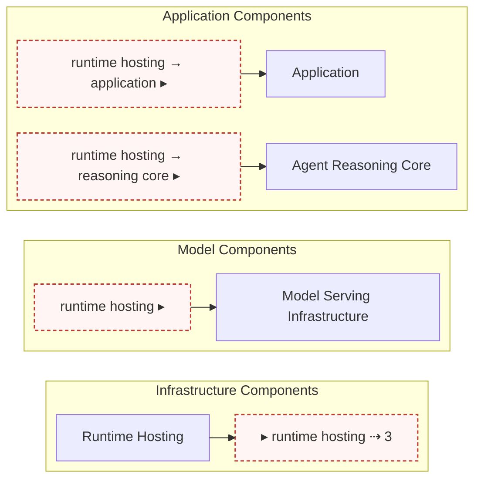

# ADR-036: Decoupled component-graph emission — aspects, channels, and bands

**Status:** Draft
**Date:** 2026-07-22
**Authors:** Architect agent, with maintainer review

---

## Context

The auto-generated component graph (`risk-map/diagrams/risk-map-graph.mermaid`, produced by `ComponentGraph` in `scripts/hooks/riskmap_validator/graphing/component_graph.py` and written by `scripts/hooks/validate_riskmap.py`) draws every edge in `risk-map/yaml/components.yaml` flat. The current emitter (`component_graph.py:76-80`) iterates `forward_map` and appends one `{src} --> {tgt}` line per edge with no intra/cross distinction, under a top-down layout: the generated `.mermaid` opens with an ELK config frontmatter (`layout: elk`, `elk.mergeEdges: false`, `elk.nodePlacementStrategy: BRANDES_KOEPF`) followed by a `graph TD` declaration, both sourced from `risk-map/yaml/mermaid-styles.yaml:65-70` (`direction: 'TD'` at line 66, the `metadata.layout`/`nodePlacementStrategy` block at lines 68-70). `ComponentGraph` itself has no topological-ranking or edge-optimization machinery — it is a plain category-subgraph plus flat-edge emitter.

Since [ADR-030](030-agentic-component-model.md) landed the four-category agentic taxonomy, the corpus has grown. As of this writing it has 42 components and 96 directed edges, 45 of which cross a top-level category boundary (`componentsInfrastructure`, `componentsModel`, `componentsApplication`, `componentsExternalTools`); these counts drift with the corpus and are not normative — the durable claim is that cross-boundary count, not total edge count, drives the clutter. The dominant driver of visual clutter is the *number of edges crossing a top-level subgraph boundary*, not the total edge count: intra-cluster edges are nearly free to route, cross-boundary edges force long spanning lines that tangle the rendering. A large share of the cross-boundary edges come from two structures: the identity/authz fan-out and the write-edges into the audit/observability sink. The sink is named by role throughout this record rather than by component id: `emission.aspects` (D3) is the normative registry of which component that is, so a rename in the corpus is a config edit rather than an erratum here. At this scale the flat diagram is no longer legible.

The clutter is removed *topologically* rather than by tuning the layout engine, because the clutter metric is boundary-crossing count and no layout-engine setting reduces that count — only rewriting which edges are drawn does. Throughout, a *cluster* is a top-level category subgraph (Infrastructure, Model, Application, Tools) and a *block* is a subcategory subgraph nested inside a cluster (e.g. Deployment or Registries inside Infrastructure) — the intermediate grouping between a cluster and an individual component node. Three levers apply, in order:

- **Aspects.** An *aspect* is a cross-cutting concern — here, an audit/observability sink that many components write to (mechanically: out-degree 0, cross in-degree above threshold — the candidacy test in D4) — that is deliberately removed from the drawn graph and recorded in a header comment instead of drawn as one more flow among many. Drawing every write into a shared sink as an ordinary edge buries the sink's real role (background infrastructure, not a subject of the diagram) under visual noise.
- **Channels.** A *channel* replaces a direct edge that crosses a cluster boundary with a labeled pair of *ports* — one where the edge leaves its source cluster (egress), one where it arrives in its target cluster (ingress). The port-to-port link is never drawn, only recorded in a header comment, so a reader traces a cluster-to-cluster relationship through matching port labels rather than a line spanning the whole diagram. Several channels that share a source cluster and a base label collapse into one *broadcast* — a single egress port annotated with its arm count and one ingress port per arm.
- **Bands.** A *band* pins a set of elements (channel ports, or a block's entry/exit nodes) to the left or right edge of their container, so every inbound port in a cluster lines up together rather than scattering wherever the layout engine happens to place it. A port band achieves this by nesting its ports in their own subgraph, not by chaining them together with invisible ordering links: the ELK layout engine treats a subgraph as a compound node whose children must occupy a contiguous region, and that contiguity constraint alone produces the column — chaining ports with links instead was tried and rejected (D1), because it actively worked against banding rather than reinforcing it. A block's entry/exit pair is small enough (one link, two real component nodes) that an invisible ordering link between them is harmless and is retained.

Applied together, these produce four vertically stacked clusters with zero lines crossing between them. The transform also surfaces two corpus-specific judgment calls — how aggressively to lift aspects, and how finely to split channels by trust concern — resolved in D4–D5 below.

**Scope boundary — presentation only.** This is an emission-layer decision. `components.yaml`'s nodes and `{to, from}` edges are fixed input; not one is added, removed, or retargeted. Every original edge either survives as a drawn intra-cluster edge, is rewired through a port pair, or is lifted into a header comment — the underlying data model is untouched. This ADR is **not** the representation ADR that [ADR-030](030-agentic-component-model.md) D10 defers. D10 reserves four questions for that future ADR — a typed edge `kind` (`data` / `consult` / `contains`), how inbound/outbound flow through a single PEP is shown, how a control-intermediated full flow is drawn, and whether the overview graph is a subset of per-category detail graphs — gated on a dedicated survey of graphical-mapping approaches. This ADR decides none of the four, and does not perform the survey; all four remain fully deferred. What it addresses is narrower: the cross-boundary clutter that makes the flat emission illegible — a legibility symptom any future D10 representation would also have to solve. It re-routes the *existing untyped* edges through ports and header comments without typing them, so the consult and containment edges ADR-030 D9 landed as plain `{to, from}` mappings still carry data-flow semantics here — re-routed, not re-typed — and the ADR-030 D9 interim mis-render debt persists until the representation ADR lands. When D10's typed edges arrive, this transform applies to the typed edge set unchanged; nothing here pre-empts or constrains that ADR's answers.

## Decision

We adopt the aspects/channels/bands transform as the emission model for the component graph, structured as a pure transform layer feeding a rewritten emission pass (D1–D2), configured through an extended `mermaid-styles.yaml` schema with a flat/decoupled mode toggle as a rollback lever (D3). Aspect membership (D4), channel granularity (D5), and channel arm-splitting (D6) state the classification rules — illustrated against the current corpus — with determinism and guard rules in D7.

### D1. Adopt the topological rewrite; reject layout-engine tuning

The component graph is emitted so that **no edge is drawn between two top-level category clusters** — not even invisible ordering edges. Cross-boundary edges are eliminated by re-routing (channels) or deletion-with-annotation (aspects); intra-cluster edges are preserved verbatim, with mirrored pairs collapsed to `<-->`. A mirrored intra-cluster pair collapses to `<-->` **only when neither endpoint is a PEP-wrapped node** — a mirrored pair where one endpoint is wrapped is retargeted through the wrapper's `_in`/`_out` ports (by the wrap→retarget→collapse ordering) and becomes a port chain rather than a collapsed link, so it never collapses. This is a topological transform of the drawn graph, applied because the clutter metric is boundary-crossing count and no layout-engine setting reduces that count. With no inter-cluster edges, ELK packs the four clusters as separate connected components into a vertical stack automatically.

The `<-->` collapse is an **intra-cluster drawing rule only**. A mirrored pair that crosses a cluster boundary is never collapsed — e.g. the agent-PEP ↔ model-serving inference pair, whose request leg attracts egress controls and whose response leg attracts ingress controls. Each direction becomes its own channel, with its own concern label and its own egress/ingress port pair: four ports total per mirrored pair. This port count is per-channel, not strictly per-pair — channel merging (broadcasts) can let two mirrored cross pairs share one egress port, as the two PEP↔model-serving mirror pairs do on their request-side `app + agent egress` channel — so the four-ports figure is the unmerged case, not an invariant. Two reasons. First, channels are directional constructs by definition — D2 keys them by `(srcRoot, tgtRoot, concern)` and D7 requires ingress ports to have out-degree exactly 1; a bidirectional port construct would break both invariants and re-introduce a second port grammar for a handful of edges' benefit. Second, the two legs are distinct trust concerns on a threat-model diagram — the request leg attracts egress controls (exfiltration prevention, call authorization), the response leg ingress controls (injection defense, sanitization) — so folding them into one label would violate the D5 fidelity rule even if the port grammar allowed it. Under D5's granularity rule these legs are counted as separate channels.

**Band ports are not chained together with invisible ordering links.** An earlier iteration chained a band's ports with `~~~` links purely to pin their relative order, reasoning by analogy with the block entry/exit case (a single such link between two real nodes is harmless). A hands-on render-verification pass (pinned mermaid-cli/ELK toolchain) found this was actively counterproductive: ELK stamps `INCLUDE_CHILDREN` hierarchy handling on any node touched by a boundary-crossing edge, which every port is by definition, silently overriding a nested subgraph's own layout direction — so each chain link forced one additional layout-engine layer of horizontal separation in the parent cluster's `LR` flow, ballooning the band, and by extension the whole diagram, sideways. The band's own subgraph nesting is what pins the elements to their container's edge (the ELK compound-node contiguity constraint alone does this); the chain links were adding sprawl, not order. They are dropped. The accepted trade-off: port order within a band is no longer emitter-declared — it falls out of ELK's own crossing-minimization heuristic, deterministic for a given corpus and toolchain version, but not a value this ADR pins.

### D2. Two-layer architecture — a transform IR, then an emission pass

The change is structured as a pure-data transform layer between the validator's adjacency maps and the Mermaid text, plus a rewritten emitter that consumes its output. The transform classifies each edge as intra or cross by `root(n) = components[n].category`; lifts configured aspect sinks; keys remaining cross edges into channels by `(srcRoot, tgtRoot, concern)` and groups broadcasts by shared `(srcRoot, concern, label)`; and splits each channel into one arm per distinct target node, each arm landing at that target (D6) — no landing selection among multiple targets occurs, and the intra-edge reachability test survives only as a self-check diagnostic (D7). It emits an **intermediate representation** — dataclasses, no Mermaid strings — describing clusters, blocks, ports, bands, PEP wrappers, and the drawn/undrawn edge sets. A separate emission pass turns that IR into Mermaid text in a fixed output order, and re-asserts an acceptance checklist (D7) as a self-check that raises on violation.

The transform/emission split is load-bearing: it keeps the *judgment-laden* classification (what is an aspect, what concern an edge carries, where a channel lands) separable and testable in isolation from the *mechanical* Mermaid serialization, and it makes the acceptance rubric expressible as assertions over the IR rather than as string scraping. This ADR fixes the two-layer contract, not the module names; a natural package layout is a `graphing/decouple.py` transform plus a rewritten `component_graph.py` emitter, but the concrete layout is an implementation choice for the downstream chain.

### D3. Configuration surface and the rollback lever

The behaviour is driven from `risk-map/yaml/mermaid-styles.yaml` under `graphTypes.component`, governed by `risk-map/schemas/mermaid-styles.schema.json`. The schema is `additionalProperties: false` throughout, so every new key is a coupled schema edit whose consumer set (the `check-jsonschema` pre-commit hook, `MermaidConfigLoader`, and the config test suites) must be updated in the same change. The added surface is:

- **`emission.mode: flat | decoupled`** — the rollback lever. `flat` is the legacy emitter (`component_graph.py` as it stands today); `decoupled` is this ADR's transform. The `MermaidConfigLoader` emergency-defaults path (`_get_emergency_defaults`) degrades to `flat`, so a missing or corrupt config never yields a half-decoupled diagram.
- **`emission.aspects`** — the list of sink component ids to lift, each with a `minCrossInDegree` guard threshold (D4, D7).
- **`emission.concerns`** — the cross-edge → concern-label map (D5). This is the channel concern taxonomy; it carries no per-entry override, since arm-splitting is a mechanical function of distinct-target count (D6), not a per-entry judgment.

  Together, `emission.aspects` and `emission.concerns` are the **normative, D7-guarded registries** for the corpus's current aspect membership and per-edge concern-label assignments. They — not this ADR's prose — hold the authoritative record of which components are lifted and which concern each cross edge carries; D4–D6 state the rules and point here for the live assignments rather than re-transcribing them.
- **`emission.portStyles`** — the `port`, `pepport`, `pepWrapOutline`, and `aspectStyle` style strings, plus the layout-direction flip. The graph declaration shifts to global `direction: LR`, replacing today's `direction: 'TD'` at `mermaid-styles.yaml:66`. Under `decoupled` mode the frontmatter otherwise **retains** the existing ELK metadata unchanged — `layout: elk`, `mergeEdges: false` (so port-to-landing edges are never coalesced), and `nodePlacementStrategy: BRANDES_KOEPF` (the strategy the band pinning is verified against in the Render-verification follow-up); only `direction` changes, from `TD` to `LR`.
- **PEP wrappers.** A *PEP wrapper* is the visual treatment a policy-enforcement-point node receives so its role as a gate is distinct from an ordinary node: the enforcement point is drawn inside its own outlined enclosure (`pepWrapOutline`) with dedicated inbound/outbound ports (`pepport`), so a reader sees traffic entering and leaving through the enforcement point rather than passing an unremarkable box. `port` styles the ordinary channel ports; `pepport`/`pepWrapOutline` style the enforcement-point wrappers.
- **Aspect marker.** A lifted aspect node is visually distinguished in the rendered diagram, not only in the invisible `.mermaid` source comment: `aspectStyle` gives it a dashed-border classDef distinct from an ordinary node, and its label gains a second line stating the lifted in-edge count (D4). This is a visible reader cue, not a duplicate registry — the count is computed from the live `LiftedAspect.edges` length on every emission, never hand-authored, so it cannot drift from the corpus the way a hand-maintained annotation could.

Concern labels are semantic knowledge about edges living in a *styling* file keyed by component-id pairs. The cleaner long-term home is an edge annotation in `components.yaml`, but that is a content-schema change and out of scope here; we accept the placement as a documented trade-off, mitigated by the fail-loud sync guards in D7.

### D4. Aspect membership and aggressiveness — conservative, lift observability only

**Aspect candidacy is a mechanical sink test, stated once here:** a component is an aspect candidate if and only if its **total out-degree is 0** (a pure sink — no outgoing edges, intra or cross) **and** its cross in-degree meets the configured `minCrossInDegree` threshold. Both conditions are enforced fail-loud (D7); the sink condition is fixed by this ADR, not configurable. Fan-out *sources* are thereby excluded from aspect candidacy by definition, whatever their cross-degree — e.g. the identity/authz plane, which has cross out-edges and no cross in-edges, fails the sink test outright. The rationale for drawing the rule at sink-ness: a pure sink receives copies of traffic and originates nothing, so removing its edges deletes no information about *who acts on whom* — while a source's fan-out is itself the relationship structure a threat-model diagram exists to show, so lifting a source could only ever hide subject matter. "Primary subject" (below) is why the sink-only rule is the right rule; it is not a second, discretionary test applied per component.

As of this writing the test selects a single component — the corpus's audit-record sink, whose id `emission.aspects` carries; its cross in-edges are lifted into a grouped header-comment inventory and the node itself is kept, rendering edgeless inside Deployment. It is not left visually unremarkable: the node carries the `aspectStyle` marker (D3) and a second label line stating its lifted in-edge count (e.g. "17 writes lifted"), so a reader can see at a glance that this node is a deliberately-simplified sink. The lifted count is *cross* in-edges, not all of them — a reader who counts writers in the corpus will get a larger number, and the difference is the sink's intra-cluster writers, which stay drawn, without needing to consult the `.mermaid` source comments. The live membership list is `emission.aspects` (D3), guarded against drift by D7 — this is a snapshot, not the registry.

The `minCrossInDegree` threshold is the remaining judgment dial, and we set it conservatively: well above the trivial-sink range but below the current sole candidate's cross in-degree, so a future second sink must be deliberately admitted by config edit rather than drifting in. The initial value lands in `emission.aspects` (D3); as of this writing it is 10. The identity/authz control plane is not an aspect candidate at all under the sink test — its fan-out is routed through channels (D5) and stays visible as the primary subject it is; likewise the `componentRuntimeHosting` / `componentToolHosting` fan-outs.

### D5. Channel granularity — split by trust concern

We take the **fidelity** end of the granularity dial: channels are split by trust concern rather than merged by cluster-pair. This is a threat-model diagram; distinct trust concerns must not share a label even when they share a cluster pair.

For example, in the current corpus a `training data` edge (`componentDataStorage → componentModelTrainingTuning`) must not be folded into a `model artifacts` channel merely because both cross the same cluster boundary: doing so would land training data at `componentModelServing`, reaching the trainer only through an eval-loop path the data never actually flows along — a directed-reachability misread the fidelity rule exists to prevent.

Applied to the current corpus, this resolves the unlifted cross edges into a set of egress groups — the identity/authz fan-out collapses into a single broadcast with one arm per distinct target (see D6 below), and each directional counterpart (registration vs. discovery, invocation vs. response) carries its own label. Edge conservation (lifted + channelled = total cross) and per-band ingress-label uniqueness are both D7 self-check invariants, re-verified on every emission — not restated here. The complete, current channel inventory lives in the `emission.concerns` block in `mermaid-styles.yaml` (normative, D7-guarded) and the generated `.mermaid` header comment (descriptive, regenerated every run); this ADR does not duplicate it — the initial concern assignment is reviewed as part of the first landing PR's config diff, not here.

### D6. Channel arm splitting — one arm per distinct target

This channel-splitting rule is not corpus-specific; it is adopted wholesale: **a channel whose member edges name more than one distinct target node in the landing cluster splits into one arm per distinct target, each arm landing at its own target.** Covering a direct target through intra-cluster reachability from another landing draws the channel's concern as flowing along paths that do not carry it — the semantic-misread class D5 (training data) and the runtime-hosting example below name — and the emitter cannot judge path semantics, so reachability-based coverage of direct targets is ruled out wholesale rather than case by case.

For example, in the current corpus the `runtime hosting` broadcast from `componentRuntimeHosting` has a Model arm and an Application arm covering two targets; those two targets are mutually reachable intra-cluster only through the network-PEP chain — a hosting relation drawn as passing through policy enforcement, the same misread class as the D5 training-data example. The rule therefore splits the Application arm into two labeled arms rather than landing both at one target. This satisfies the duplicate-label constraint (two identically-labelled ingress ports in one band are forbidden, since a reader could not tell the arms apart) and keeps the hosting relation from being misdrawn as passing through the PEP.

The following is illustrative, using the runtime-hosting channel as it exists today — the port-id grammar, header-comment convention, and containment structure are normative (D7); the specific arms shown and the `⇢ 3` count are corpus-dependent and will change as the corpus does.

Every ingress port has exactly one outgoing edge to its landing node; no line is drawn between the egress port and any ingress port, so no edge crosses a cluster boundary.

As a second example: under a most-frequent-target landing rule (rather than this one-arm-per-target rule), the identity/authz broadcast's PDP-to-authorization-PEP verdict edge would be covered only via the tool data path it exists to gate — a policy consult drawn as flowing through the exact mechanism it's supposed to police, the same misread class again. Per-band label uniqueness (D7) is preserved by construction: every arm gets its own distinct label.

By construction, every arm lands at a literal target of its member edges; reachability never justifies a landing, and the reachability test (D2) is thereby a diagnostic, not a landing mechanism. A target with no intra in-edges (e.g. `componentFederationProxy`) forces a split under any rule. The single-landing alternative (fewer ingress ports, arms covered transitively) is rejected on the same fidelity grounds throughout this section; its port savings are bought entirely with semantic misreads.

### D7. Determinism, stable ids, and fail-loud guards

- **Byte-stable output.** Same YAML in → byte-identical `.mermaid` out; all iteration is sorted, no unstable-order hashing.
- **Content-derived port ids**, never positional (`p_in_0`…), so adding one component does not renumber every port and blow up the regen diff. Egress ports are `p_out_<root>_<slug(concern)>`. Ingress ports are `p_in_<root>_<slug(concern)>` where the root has exactly one arm for that concern; where the same `(root, concern)` has multiple distinct-target arms — counted across every channel landing there, not within a single channel — the target is appended as `_<slug(target_short_name(target))>`, which is what produces D6's `p_in_app_runtime_hosting_application` and `p_in_app_runtime_hosting_reasoning_core`. `<root>` is the abbreviated category token (`infra`, `model`, `app`, `tools`), not the full category id from D2's `root(n)`; an unrecognized future category falls back to its id minus the `components` prefix, lowercased. `target_short_name` strips the `component` prefix and splits camel case, so the target segment reads `reasoning_core` rather than `componentreasoningcore`.
- **Fail-loud, not heuristic-silent.** Any of the following raises a loud warning, promoted to error under the existing `validate_riskmap.py --block` machinery: a configured aspect that no longer matches its `minCrossInDegree` guard (corpus drift); a configured aspect that acquires any outgoing edge (sink-condition violation); a `concerns`/`aspects` id absent from the corpus (rename drift); or a new cross-boundary edge with no `concerns` entry. Concern labelling thereby becomes part of the contribution workflow without ever silently mislabelling an edge.
- **Block-level orphan check.** Lifting an aspect must not leave its block with zero drawn intra edges — if it would, the lift is refused and the edges are reclassified as a channel instead, with a loud warning.
- **Emission self-check** re-asserts the acceptance rubric over the built output: zero drawn node-pairs spanning two roots (including invisible `~~~` links), every `⇢ n` broadcast having exactly `n` matching ingress arms, ingress out-degree exactly 1, per-band label uniqueness, edge-conservation count, and every original `style`/`classDef` line preserved. A generator that silently emits a wrong diagram is worse than one that raises.

### D8. Display-layer acronym substitution — a closed, declared set, never touching ids

Every rendered display string in this emitter is, until now, faithfully source-derived: node titles come straight from `components.yaml`'s `title` field, arm labels from the id-derived `target_short_name()`. This section introduces the first exception: the emitter may render a **closed, explicitly-declared set** of standard security/AI terms in their conventional acronym form, applied at display time only. The initial set is a single entry — `"policy enforcement point"` (case-insensitive phrase match) → `"PEP"` — added because it is the only such term dense enough in the current corpus (14 occurrences: 4 node titles, 6 derived arm-label suffixes) to move a real render-verification measurement: it was the sole cause of every node title exceeding the diagram's own `wrappingWidth: 250` design target, and shortening it measured a real width/height/area reduction on the live corpus. This is not an open license — additions to the set are a deliberate, reviewed edit, not an ad hoc practice a future contributor extends by adding another dict entry without discussion. `"policy decision point"` → `"PDP"` was evaluated alongside PEP (same NIST 800-162/800-207 pairing) and is **explicitly held out of this set** — its single occurrence already fits the wrap target, so it has no measured justification, though it remains the natural next candidate if it's ever revisited.

**The hard invariant.** The substitution is a pure display overlay on rendered label strings — node titles (`_decoupled_member_lines`/`_decoupled_pep_wrap_lines`) and an arm's *display* label (`_build_arms`'s `arm_label`) only. It must never reach `slug()`, `target_short_name()`'s id-derivation path, `pep_wrap_base()`, or any port-id construction — port ids stay byte-stable per D7's content-derived-id requirement. `_build_arms` already computes `arm_label` and `port_id` as separate expressions from separate calls, so this is a preserved invariant, not new engineering; a D7-style self-check assertion (a port id is byte-identical with the substitution applied or not) is recommended as a regression guard, tracked in Follow-up rather than mandated here.

**Scope boundary, restated.** `components.yaml`'s `title` field is untouched by this — the same "presentation only" boundary this ADR already claims, extended from re-routing/styling to term-rendering at a new site, not a new exception to it.

**Placement: a fixed code constant, not a config registry — for now.** D3 externalizes judgment-laden, corpus-specific label semantics (`emission.concerns`) to `mermaid-styles.yaml` under D7's fail-loud guards, because those labels encode a human judgment call about this corpus's trust concerns. A standard acronym is the opposite: a universal, external convention, not a per-corpus judgment — closer to D4's sink-only rule (fixed in this ADR, not configurable) than to D5's declared concern taxonomy. The set is therefore a fixed constant in the emitter, not a config entry. Trip-wire: if this set ever grows past one or two universal, uncontested terms, or starts absorbing anything corpus-specific or contestable, promote it to a D3-style declared registry with D7 discipline rather than letting the fixed-constant list grow unbounded.

### D9. Consult-class channel landing — route to the component, not to the gate's `_in` port

D6 fixes *how many* arms a channel has and *which node* each one lands at; this section fixes *where within that node* an arm lands when the target is a PEP-wrapped gate. The two are separable: D6's one-arm-per-distinct-target rule is unchanged here, and so is D5's concern assignment.

**The problem.** Under D3's PEP wrappers, a channel arm targeting a wrapped enforcement point lands on the wrapper's `_in` port, so a reader sees traffic entering through the gate. That is right for data-flow: a tool call, a tool-discovery lookup, or an inference response genuinely traverses the enforcement point on its way somewhere. It is wrong for a **consult**. The policy decision point's verdict and the identity provider's attributes are *consumed by* the enforcement point — they are the inputs to its decision, and they stop there. Drawing them into `_in` puts them alongside the request on the same inbound gate, which reads as a second parallel stream of the same kind and obscures the invocation path the diagram exists to show. This is the in-flow-enforcement vs off-path-decision distinction: the enforcement point is in-flow (request and response data pass through it), the decision and information points are off-path (the enforcement point consults them; no request data flows through them to a destination).

**The rule.** A **consult-class** channel arm whose target is a PEP-wrapped node lands on the **component id**, not on the wrapper's `_in` port. Data-class arms are unchanged: they continue to land on `_in`. Because the PEP node is declared *inside* its wrap subgraph (D3), a consult arm still terminates visibly at the enforcement point — it simply arrives at the box rather than through the inbound gate, which is the intended reading.

The rule touches the landing site only. An arm's port id and display label are computed independently of its landing (D6, D8) and are byte-identical either way, so D7's content-derived-id stability is preserved and the classification cannot renumber a port. The self-check invariants are likewise untouched: the arm edge stays intra-cluster by construction (the port is emitted in the target's own band), ingress out-degree stays exactly 1, and per-band label uniqueness is unaffected.

**The classifier: concern-keyed, from the existing registry.** Consult-ness is a property of the *concern*, and D5's `emission.concerns` registry already partitions cross edges by exactly that judgment. The classifier is therefore a **closed, fixed-in-code set of consult-class concern labels**, matched against the label the transform has already resolved for the edge. No new schema field, no new config key, no second place to declare the same judgment.

**The set is two labels, not one, and it grew before ADR-030 D10 rather than at it.** An earlier draft of this decision carried one label — `identity & authz` — described as the corpus's only off-path fan-out. That was true when written and stopped being true within the same release: **ADR-030 v2** — which at the time of writing exists on `develop` only, so the [link](030-agentic-component-model.md) resolves to v1 on `main`, where these decisions are not present — D14 resolves the tool-registry consult onto the agent network enforcement point and states in terms that it is "a `reliesOn` relation from an enforcement point to an authority, not a data flow", and D9 lists the federation proxy's two edges into the network enforcement points under Consult. The proxy's edges inherit the identity label; the registry consult does not, and under a discovery-shaped label it would have landed on the gate's `_in` port and drawn as a request entering the gate — the exact misread this decision exists to prevent.

Recording that the set grew is more useful than quietly growing it. It is evidence about the concern-label proxy's durability: the proxy assumes every edge sharing a concern shares a class, and the horizon over which that assumption held turned out to be one release rather than the D10 timeframe this decision anticipated. Two labels remains inside the trip-wire below; a third is the signal to promote consult-ness to a declared per-concern config field rather than to widen the set again.

This borrows D8's fixed-constant placement, and it inherits D8's trip-wire in a sharper form: a concern *label* is corpus-specific and rename-able in config, so a set keyed on label strings can silently go stale in a way D8's universal acronym cannot. That failure mode is closed by pinning the coupling — **the shipped `emission.concerns` registry must declare every label in the emitter's consult set**, asserted against the committed `mermaid-styles.yaml` alongside the other live-config invariants. A rename fails that assertion rather than quietly reverting four arms to `_in`.

The pin deliberately sits over the *shipped* config rather than inside `check_emission_drift`, and the reason is a limitation worth recording: at transform time the emitter cannot tell "this config declares no consult-class concern" from "the consult-class concern was renamed." Every reduced or synthetic config is legitimately the former, so a runtime warning on a missing consult label would fire on inputs that are not drifting — the exact false-positive noise D7's guards are designed to avoid. The invariant is only meaningful against the one registry that is supposed to carry the label, so that is where it is checked. This asymmetry with D7's other guards is itself an argument for the per-concern config field in Alternatives: declaring consult-ness next to the label would make the coupling structural and bring the check back under D7's runtime guard table. If the set grows past two labels, or starts encoding contested per-edge judgment, that promotion is the move — a schema change and its own decision. The bound is asserted in the test suite, so a third label fails rather than accumulates.

**Scope boundary, and the classifier is interim.** This types nothing in `components.yaml`. The consult edges remain the plain `{to, from}` shoehorn ADR-030 D9 landed, and ADR-030 D10's deferred typed-edge `kind` question stays fully deferred; D9 here is a presentation-layer landing rule read off a label the emitter already has, not an edge-model change.

**The concern-label classifier is explicitly a stopgap, and it expires when ADR-030 D10 lands.** Consult-ness is a property of the *edge*, and the corpus has nowhere to declare it — so this reads it off the nearest available proxy, the concern label the transform already resolved. That proxy holds only while every edge sharing a concern shares a class, which is true of today's corpus and is not guaranteed of any future one. When D10's survey settles the typed-edge question, the classifier's **input** must be swapped from the concern label to the declared kind. The **rule** — consult lands on the component, data lands on `_in` — is what this decision fixes and is expected to survive that swap unchanged; the mechanism reading it is not. Whoever executes D10 owns that swap, and the two decisions are cross-referenced so it is not rediscovered by accident (see Follow-up).

Symmetrically, no consult edge in the current corpus *originates* at a wrapped PEP (the corpus models the consult as decision-point → enforcement-point), so the egress-side mirror is not exercised and is deliberately not built; the same reasoning would apply at the `_out` port if such an edge ever appears.

## Alternatives Considered

- **Stay with flat emission plus manual/layout tuning.** Keep `component_graph.py` as-is and lean on ELK options (`nodePlacementStrategy`, `mergeEdges`, direction) or hand-editing to reduce clutter. Rejected: clutter tracks the count of edges crossing a top-level boundary, and no layout setting changes that count — dozens of spanning edges tangle under every engine setting. Hand-editing a generated artifact is not durable; the next regen overwrites it. This is the counterfactual the topological argument in D1 rules out.
- **Hand a general graph-layout library the flat graph and let it decide.** Adopt a different renderer or an automatic edge-bundling/orthogonal-routing library without the aspects/channels model. Rejected for the same topological reason: bundling and routing reduce the *visual noise* of crossings but do not reduce their *number*, and they cannot know that the logging sink is background noise to be lifted or that the identity plane is a primary subject to be kept — those are semantic, human-owned decisions the aspects/channels model encodes and a layout library cannot infer.
- **Infer concern grouping/labels heuristically from topology (subcategories, id patterns).** Derive the channel concern taxonomy (D3, D5) automatically from graph structure instead of declaring it in the `emission.concerns` registry. Rejected: payload semantics are not derivable from graph structure — a topology-only classifier cannot distinguish edges that share a cluster-pair boundary but carry different trust concerns (e.g. it would fuse hosting-related channels together and collapse the `training data` / `model artifacts` distinction, since both connect the same two clusters); labels are declared, topology is computed.
- **Single-pass augmentation of the existing emitter (no IR).** Fold channel/aspect logic directly into `build_graph` without an intermediate representation. Rejected as the ADR-level architecture: it entangles judgment-laden classification with string serialization, makes the acceptance checklist expressible only as fragile post-hoc string scraping, and resists unit-testing the transforms in isolation. The two-layer contract in D2 is what this ADR fixes.
- **Merge channels by cluster-pair to minimize port count (the low-fidelity granularity end).** Rejected per D5: on a threat-model diagram, collapsing distinct trust concerns into one label misrepresents the model and reintroduces the directed-reachability misreads D5/D6 name.
- **Land the runtime-hosting broadcast's Application arm at a single node instead of splitting it.** Land both `componentApplication` and `componentReasoningCore` targets at `componentApplication` alone, reading the hosting relation as "provisions the app, which contains the agent." Defensible, but rejected on the same fidelity grounds as the D5 training-data split: it would draw the hosting relation as passing through intervening components (the network-PEP chain) it does not actually depend on.
- **Define aspect candidacy broadly enough to lift the identity/authz plane too (any high-cross-degree hub, source or sink), cutting many more cross edges.** Rejected, and the candidacy test in D4 is written to make this structurally impossible rather than merely disfavored: aspects are pure sinks (out-degree 0), and the identity plane is a fan-out source (cross out-edges only, no cross in-edges). A source's fan-out is the subject matter of a security diagram — lifting it would hide the very structure the diagram exists to show — which is why the mechanical rule is drawn at sink-ness instead of leaving source-lifting as a per-corpus judgment call.
- **Land every arm on a wrapped PEP's `_in` port, consult or not (the status quo D9 changes).** Keep one uniform landing rule and accept that a consult renders identically to a request. Rejected: on a threat-model diagram the off-path consult and the in-flow request are different relationships, and drawing them into the same inbound gate reads as two parallel inputs of the same kind — the same class of semantic misread D5 and D6 reject elsewhere, here at the landing site rather than at the label or the arm count.
- **Declare consult-ness per concern entry in config (`emission.concerns[].consult: true` or a `class: data | consult` field).** The cleanest long-term home: co-located with the label it qualifies, immune to rename drift by construction, and visible in the config diff a reviewer already reads. Rejected *for now* on cost, not correctness — `mermaid-styles.schema.json` is `additionalProperties: false`, so a new key is a coupled schema edit dragging in the `check-jsonschema` hook, `MermaidConfigLoader`, and the config test suites, to declare a single bit that the concern label already determines. D9's shipped-config pin closes most of the gap, though not all of it: the pin catches a rename, while a declared field would make the coupling structural and put the check back inside D7's runtime guard table. It is the right promotion target if the consult set ever grows or becomes contested (D9's trip-wire).
- **Add a typed edge `kind` (`data` / `consult` / `contains`) to `components.yaml` and route on that.** The honest model, and the one the underlying finding actually asks for. Rejected as out of scope: this is precisely [ADR-030](030-agentic-component-model.md) D10's first deferred question, gated there on a dedicated survey of graphical-mapping approaches, and this ADR's Scope boundary commits to deciding none of the four. Deciding it here as a side effect of a landing-site fix would pre-empt that survey with an emission-layer convenience. D9 is written so the typed-edge answer, when it lands, replaces the classifier's input without disturbing the rule.
- **Infer consult-ness from the endpoints' roles (id patterns: a `PolicyDecisionPoint` or `IdentityProvider` source, a `PolicyEnforcementPoint` target).** Rejected on the same ground as the heuristic concern-inference alternative above: payload semantics are not derivable from graph structure. The target's role cannot distinguish the two classes at all — every edge at issue targets a PEP, and four of them are data-flow — so the test collapses to pattern-matching the *source* id, which hardcodes a naming convention as semantics and misroutes the first consult from a non-decision-point source or the first genuine data edge out of a decision point.
- **Split the graph into multiple smaller diagrams — an overview plus per-category detail views, or one diagram per top-level category (instead of the aspects/channels/bands transform).** [ADR-030](030-agentic-component-model.md) D10 itself floated "whether the overview graph is a subset of per-category detail graphs" as part of the deferred representation problem. Per-category diagrams eliminate cross-boundary clutter for free and introduce *zero* new visual vocabulary — no ports, bands, aspects, or wrappers to learn. Rejected as the primary model here: splitting removes the single-diagram overview a reader needs to see how the four tiers relate to one another at all, and the cross-tier relationships (the identity/authz fan-out, the model-serving and hosting flows) are precisely what a security reader comes to this diagram to see — arguably its more important use case. The aspects/channels/bands transform keeps that one overview legible rather than fragmenting it. Per-category detail views remain available as a **future complement** (they are the D10 overview-vs-detail question, not foreclosed by this ADR), not a replacement for the single overview.

## Consequences

**Positive**

- A component graph that is legible at 50+ nodes: four vertically stacked clusters with zero lines crossing between them. Cross-cluster traffic is summarized as a small set of labeled ports instead of dozens of tangled spanning edges.
- The clutter fix is regenerated deterministically from YAML on every run, not hand-maintained — it survives corpus edits, with fail-loud guards (D7) forcing new cross edges to be classified rather than silently mislabelled.
- The classification rules (D4, D5, D6) are locked before implementation, so the classification logic is not relitigated during the TDD chain; the initial per-edge concern assignments are reviewed as part of the first landing PR's config diff.
- The `flat` mode toggle (D3) is a clean rollback lever and enables A/B rendering during review.
- The invocation path stays readable through a wrapped enforcement point (D9): only traffic that actually traverses the gate is drawn entering it, so an off-path consult no longer competes with the request for the reader's attention on the same inbound port.

**Negative**

- **New config surface with a schema coupling.** The `emission` block is a coupled edit to `mermaid-styles.schema.json` (`additionalProperties: false`), dragging in the `check-jsonschema` hook, `MermaidConfigLoader`, and the config test suites in the same change.
- **Semantic labels live in a styling file.** Concern labels are edge semantics keyed by component-id pairs in `mermaid-styles.yaml`; the cleaner home is a `components.yaml` edge annotation, deferred as a content-schema change. Accepted trade-off, mitigated by the D7 sync guards.
- **The `flat` rollback lever means two emitters are maintained indefinitely.** Keeping `emission.mode: flat` (D3) as a rollback path keeps the legacy flat emitter (`component_graph.py` as it stands today) alive and under test alongside the new decoupled transform — two code paths, two sets of expectations, and a regression surface that never fully retires. This is the standing cost of the rollback and A/B-rendering benefit noted in Positives; it is accepted as the price of a safe flip, but it is a real ongoing maintenance burden, not a free option, and a future decision to delete `flat` once `decoupled` is trusted would be the way to retire it.
- **A heuristic-vs-fail-loud-guard tension for aspect detection.** Aspect membership is human-declared (D4) but guarded by its candidacy guards (sink condition and `minCrossInDegree`); the guard must warn loudly on drift without either silently lifting a mis-declared sink or hard-blocking every regen. D7 resolves this toward fail-loud-under-`--block`, but the tension is real and lives in the config contract.
- **A second landing rule, keyed on a rename-able label (D9).** Arms now land in one of two places depending on their concern, so "where does this arm land" is no longer answerable from the arm alone. The consult-class set is keyed on concern label strings, which are corpus-specific and editable in config; the shipped-config pin turns a rename into a test failure rather than a silent revert to `_in`, but it is a weaker instrument than D7's runtime guards — it can only be asserted against the committed registry, not computed per emission — and that is the reason the trip-wire to a declared registry is written into D9.
- **Generated-diagram diffs become less line-by-line obvious.** The `.mermaid` output is now IR-derived (ports, bands, wrappers, reordered emission) rather than a flat edge dump, so a reviewer can no longer read a diagram diff as a direct mirror of a `components.yaml` edge change. Content-derived stable ids (D7) and the two-PR landing (code+config at `mode: flat`, then the flip+regen as its own diff) mitigate this.
- **Renderer risk.** The band pattern depends on ELK behaviour; the mermaid-cli / puppeteer stack must be re-verified before the default flips, via a render smoke test and a port x-position measurement (ingress ports pinned to the left edge, egress to the right).
- **The full lifted-edge inventory and port-to-port hops are still invisible in the rendered SVG.** The grouped per-source-cluster inventory and the undrawn `p_out ⇢ p_in` hop list live only in `.mermaid` header comments, which do not survive rendering — channel tracing still relies entirely on a reader label-matching an egress port to its ingress port with no drawn line between them. The sink node itself is no longer unremarkable (D3/D4: it carries the `aspectStyle` marker and a live "N writes lifted" count directly in the rendered node), but *which specific edges* were lifted remains source-only. The clutter reduction therefore still partly transfers information out of the rendered image into source-only comments, narrower in scope than before. Accepted as the cost of legibility at this scale; a further mitigation — inline channel-hop counts on the ports themselves — remains a worthwhile future improvement, out of scope for this emission change.

**Follow-up**

- **Lifecycle.** This ADR lands as `Status: Draft`; sign-off flips it to `Accepted` and gates the standard testing → code-reviewer → swe → code-reviewer implementation chain, with the ADR as the contract.
- **Two-PR landing.** Land the transform, config, schema, and guards with `emission.mode` defaulting to `flat` first (no diagram churn); flip to `decoupled` and regenerate `risk-map/diagrams/` and `risk-map/svg/` in a second PR so the diagram flip is its own reviewable diff.
- **Index reconciliation.** Landing this ADR requires adding a `036` row to the index table in `docs/adr/README.md`, and reconciling its ADR numbering against the canonical `main` branch at merge time to confirm `036` is still free.
- **Render verification.** Before the flip, render the graph with mermaid-cli and measure port x-positions (ingress ≈0.0–0.1, egress ≈0.9–1.0) to confirm the bands pin as intended.
- **Possible content-schema follow-on.** If concern labels prove better modeled as edge annotations in `components.yaml`, that is a separate content-schema ADR, not part of this emission change.
- **D9's consult classifier expires with [ADR-030](030-agentic-component-model.md) D10 — this is a dependency, not a suggestion.** D9 routes consult-class channel arms by matching a closed set of concern labels, because the corpus has no way to declare that an edge is a consult. That is a proxy, sound only while every edge sharing a concern shares a class. **When D10's typed-edge survey lands a real `kind`, the classifier's input must be swapped from the concern label to the declared kind**; the landing rule itself needs no change. The resolution is fixed here in advance so the work is mechanical when the time comes, rather than a rediscovered surprise: replace the label-set lookup with a kind check, delete the shipped-config pin that guards against label rename, and drop the consult-set constant. ADR-030 D10 does not yet carry a reciprocal pointer to this record; adding one is owed as part of this dependency, so that whoever executes the survey sees this consumer without having to know ADR-036 exists.
- **Consult-only wrapped target (D9).** D9 moves a consult arm off the wrapper's `_in` port. A PEP-wrapped component whose *only* inbound channel arm is consult-class, and which has no intra-cluster in-edges either, would therefore render an `_in` port with nothing entering it. This is not reachable in the current corpus — `componentAuthorizationPolicyEnforcementPoint` is the sole consult-only channel target and keeps an intra in-edge from `componentToolInputHandling`, which the untouched intra-edge path still routes through `_in` — and it violates none of D7's self-checks, which assert ingress *out*-degree but say nothing about a port's in-degree. If a second consult-only wrapped target ever appears, resolve it deliberately: either prune a wrapper port that ends up with no incoming edge, or add a port in-degree assertion to the D7 rubric so the case fails loudly rather than rendering a dangling port.
- **Acronym-substitution self-check (D8).** Add a self-check assertion that a port id is byte-identical whether the D8 acronym substitution is applied or not, guarding the display/id separation D8 depends on against silent regression.
- **Regen-before-block ordering (post-flip).** The `regenerate-graphs` pre-commit hook runs without `--block` and without `fail_fast`, so a registry-drift failure from `validate-component-edges --block` still lets `regenerate-graphs` regenerate and write a degraded diagram (synthesized fallback labels) into the working tree before the commit is blocked. The commit itself is still rejected — nothing lands — but a contributor's working tree gets silently rewritten. This is a no-op today (`mode: flat` output is byte-identical regardless of drift), but becomes a real, if minor, rough edge once `mode: decoupled` is live. Worth a `--block` on the regen invocation, or documenting the working-tree side effect, when the mode flip lands.
