# Coalition for Secure AI Risk Map (CoSAI-RM)

Welcome to the **Coalition for Secure AI Risk Map (CoSAI-RM)**. This project provides a framework for identifying, analyzing, and mitigating security risks in Artificial Intelligence systems. The goal is to create a shared understanding and a common language for discussing and addressing the unique security challenges of the AI development lifecycle.

---

## About The Project

Traditional software security practices are not always sufficient for AI systems. The introduction of large datasets, complex training processes, and new user interaction models creates a different set of vulnerabilities. 

The CoSAI Risk Map addresses this by providing a structured map of the AI security landscape.

The Risk Map is broken down into four key areas:

* **Components**: The fundamental building blocks of an AI system, from data sources to the final application.
* **Risks**: The potential security threats that can affect these components, such as Data Poisoning or Model Evasion.
* **Controls**: The security measures that can be implemented to mitigate these risks.
* **Personas**: Seven standard actors in the AI ecosystem (e.g., `Model Provide`, `Application Developer`, etc) that define who owns a control and who is impacted by a risk.

## Quickstart

### How to Use

This repository is designed to serve both human practitioners and automated systems.

* **For Human Review (Learn & Assess)**: 
    * Use the **Markdown Tables** in [`./tables/`](./tables/) to navigate the framework. Start with the `summary` tables for context and move to `full` tables for implementation details.
* **For Tooling & LLMs (Integrate)**: 
    * Use the **YAML Data Files** in [(`./yaml/`)](./yaml/)  as structured context for RAG applications, GRC platforms, or automated CI/CD security checks.
* **For Development (Build)**: 
    * Leverage the **JSON Schemas** [(`./schemas/`)](./schemas/) to extend the framework for custom organizational needs or to validate new entries.
    * See [Contributing to the Risk Map](./docs/developing.md) for authoring and validation details.

### Project Structure

The framework is organized into a set of YAML files for easy reading and JSON schemas for validation and tooling.

* **Data Files (`.yaml`)**: These files contain the core content of the risk map.
    * yaml/
        * `components.yaml`: The components of an AI system.
        * `risks.yaml`: A catalog of AI security risks.
        * `controls.yaml`: A list of security controls.
        * `personas.yaml`: Definitions of the primary personas.
        * `self-assessment.yaml`: Security self-assessment questionnaire based on this framework.
* **Tabular Data Files (`./tables/*.md`)**: Contents of the CoSAI risk map in markdown table format for easy review and reading.
    * tables/ 
        * Three formats: 
            * `*-full.md`: Provides complete details for every entry, including all metadata, mappings, and relationships (e.g., `risks-full.md` includes descriptions, examples, and full mappings)
            * `*-summary.md`: Provides a concise overview with key identifying information (ID, Title, Description, Category) suitable for quick scanning
            * `*-xref-*.md`: Provides cross-reference tables (specifically for controls) that link entities together, such as mapping controls to the risks they mitigate (`controls-xref-risks.md`) or the components they protect (`controls-xref-components.md`)
* **Schema Files (`.schema.json`)**: These files define the structure for the associated YAML files.
    * schemas/
        * `components.schema.json`, `risks.schema.json`, etc.
* **SVG Files (`.svg`)**: Automatically generated graphical visualizations
    * svg/
        * `risk-map-graph.svg`: Component relationship visualization showing the complete AI system architecture
        * `controls-graph.svg`: Control-to-component mapping visualization
        * `controls-to-risk-graph.svg`: Control-to-risk mapping visualization
        * `map.svg`: Legacy comprehensive visualization (being phased out in favor of the above focused diagrams)

## Background
Building and using AI systems involves many potential risks. We created the Securing AI Framework to help manage these risks by tackling several foundational challenges. The industry needed:

* **A common language:** The lack of a shared vocabulary for AI risks created significant confusion, making it difficult to consistently track, discuss, and mitigate threats. For example, the technique of tricking a large language model into unintended behavior through carefully crafted inputs might be described as prompt injection, instruction hijacking, prompt hacking, or more broadly jailbreaking. The threat of intentionally corrupting training data to compromise the model might be called data poisoning, training data attacks, backdoor injection via data, or data contamination. 

* **A clear picture:** Without a shared mapping of the entire AI system, it was difficult to understand how components connected or anticipate where risks might arise. This kept security discussions abstract, hindering the ability to pinpoint specific vulnerabilities and collaborate on defenses. 

* **More focus beyond the model:** An overemphasis on the model and model-centric threats like prompt injection and model theft often obscured significant risks across the broader AI ecosystem, including threats to data pipelines, infrastructure, and deployment processes. We needed a holistic framework capable of identifying risks throughout the entire system, not just within the isolated model.

To address these needs, we developed the Securing AI Framework Map, with supporting documentation about the components, risks, and controls. 

To help practitioners more easily navigate the Map and documentation most relevant to them, we also created the Securing AI Risk Assessment, which gives users personalized risk information after they answer a few questions. 

## Design
The Securing AI Map structures the AI development lifecycle into four primary groupings of components, providing a standardized view of the end-to-end process: **Data, Infrastructure, Model,** and **Application**. Practitioners can understand the processes and components involved in creating and using AI models, and more specifically, which risks are involved in the lifecycle at which stage. 

The visualization uses a top/bottom division. The bottom half details the model creation lifecycle, typically managed by AI development teams (such as data scientists and ML engineers) and the infrastructure that supports that process (storage, serving). The top half covers the process of building model-based applications. This structure clarifies which risks are most relevant to specific organizational roles and responsibilities.

For clarity, the map is simplified to highlight the most critical components for understanding the end-to-end AI workflow and key areas of risk. Some components and processes are grouped together based on common risks and controls. For example, different teams may handle model training versus model finetuning at different points in the development lifecycle, but the risks and safeguards during these processes are generally the same. Certain cross-cutting threats, such as supply chain issues affecting artifact integrity, are not depicted individually as they can impact nearly every stage of the lifecycle.

### Key design decisions and tradeoffs

We made several design choices while creating this visualization:

* **Central model representation:** The machine learning model artifact is represented only once, positioned centrally. We considered alternatives, such as showing separate instances for "model in training," "model in storage," and "model in production." However, depicting the model centrally highlights its fundamental role and its direct connection to the surrounding infrastructure.  
* **Placement of storage and serving:** "Model Storage" and "Model Serving" are shown connected beneath the central model artifact. This reflects our view of them primarily as *infrastructure components* supporting the model, rather than distinct sequential steps occurring *after* the model's conceptual finalization. An alternative valid representation could place "Model Serving" sequentially after the model to better illustrate the operational flow. Our chosen layout prioritizes grouping related infrastructure elements together in the “Infrastructure” section of the map.   
* **Agentic systems representation:** The map now includes a detailed breakdown of agentic systems, showing the interplay between the agent reasoning core, orchestration components (tools, memory, RAG content), and agent-specific input/output handling. While agentic systems introduce significant complexity—such as calling other models and intricate interactions with external services—the visualization balances detail with clarity by organizing these components into logical subcategories within the Model and Application sections.   
* **A short risk assessment**: For the risk assessment, our top priority was to keep the questionnaire short, so that users could complete it in just a few minutes. We also prioritized having a design that does not save information about people’s answers, while retaining the ability for users to share results.   

### Recent Enhancements (October 2025)

**Completed:**

1. **Expanded agentic components:** The map now provides a comprehensive view of agentic systems, breaking down the previously simplified "Agent/Plugins" box into detailed components including:
   - **Agent Reasoning Core**: The model's ability to reason about user goals and create execution plans
   - **Orchestration**: Input/output handling, external tools and services, model memory, and RAG content
   - **Agent-specific components**: Input/output handling, user queries, and system instructions

   This expansion enables practitioners to better understand the security implications at each stage of agent operation, from receiving user input through reasoning and planning to executing actions via external tools.

2. **Control mapping visualizations:** The framework now includes automated generation of control-to-risk and control-to-component mapping diagrams, providing clear traceability between security controls and the risks they mitigate. See the [Control Mapping](#control-mapping) section below for details.

### Future directions

While significant progress has been made, opportunities for continued enhancement include:
- **Enhanced risk assessment personalization**: Expanding the self-assessment questionnaire to provide more granular risk profiles
- **Supply chain visualization**: Adding explicit representation of supply chain risks that affect multiple lifecycle stages

## Control Mapping

The CoSAI Risk Map includes comprehensive mapping between controls, risks, and components, providing traceability throughout the AI security lifecycle. These mappings are automatically generated from the YAML definitions and visualized as interactive diagrams.

### Control-to-Risk Mapping

The control-to-risk mapping ([`controls-to-risk-graph.svg`](./svg/controls-to-risk-graph.svg)) shows which security controls address specific risks. This visualization helps practitioners:

- **Identify applicable controls**: Quickly find which controls mitigate a specific risk
- **Assess coverage**: Understand which risks have multiple defense layers
- **Plan security implementations**: Prioritize control deployment based on risk exposure

Each control in [`controls.yaml`](./yaml/controls.yaml) includes a `risks` field that explicitly lists the risks it addresses. This bidirectional mapping ensures consistency and enables automated validation.

### Control-to-Component Mapping

The control-to-component mapping ([`controls-graph.svg`](./svg/controls-graph.svg)) illustrates where in the AI system lifecycle each control should be applied. This helps teams:

- **Assign ownership**: Clarify which teams are responsible for implementing specific controls
- **Understand scope**: See which components are affected by a control implementation
- **Trace impacts**: Analyze how control changes affect different parts of the system

Each control specifies applicable `components` and `personas` (Model Creator or Model Consumer), enabling role-based security guidance.

### Automated Generation

These mappings are automatically generated and validated through the project's development workflow:

- **Pre-commit hooks**: When YAML files are modified, corresponding Mermaid diagrams and SVG visualizations are regenerated
- **CI/CD validation**: GitHub Actions ensure all mappings remain consistent with the YAML definitions
- **Bidirectional validation**: The framework validates that component edges, risk references, and control mappings are correctly cross-referenced

See the [Validation Tools](./docs/validation.md) and [CI/CD](./docs/ci-cd.md) documentation for details on the validation and generation process 

