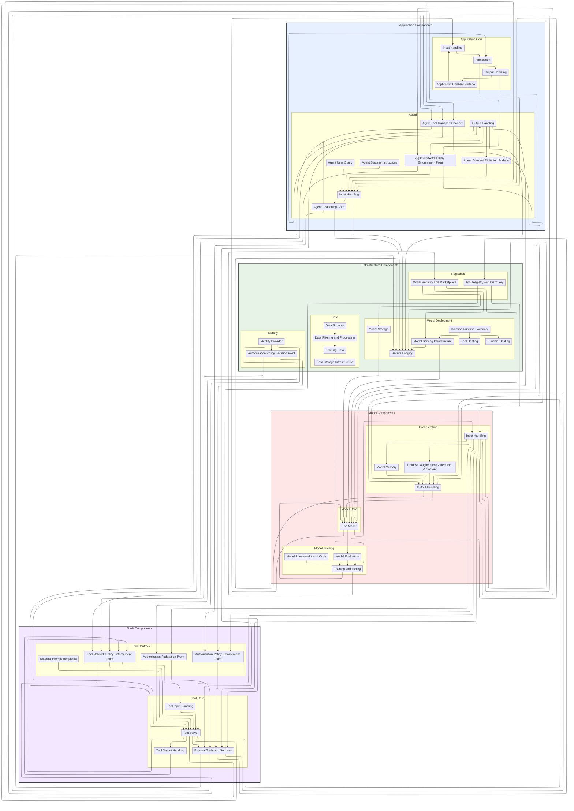

```mermaid
---
config:
  layout: elk
  elk:
    mergeEdges: False
    nodePlacementStrategy: BRANDES_KOEPF
---

graph TD
   %%{init: {'flowchart': {'nodeSpacing': 25, 'rankSpacing': 30, 'padding': 5, 'wrappingWidth': 250}}}%%
    classDef hidden display: none;
    classDef allControl stroke:#4285f4,stroke-width:2px,stroke-dasharray: 5 5

    subgraph componentsInfrastructure ["Infrastructure Components"]
        subgraph componentsData ["Data"]
            componentDataFilteringAndProcessing[Data Filtering and Processing]
            componentDataSources[Data Sources]
            componentDataStorage[Data Storage Infrastructure]
            componentTrainingData[Training Data]
        end
        subgraph componentsModelDeployment ["Model Deployment"]
            componentIsolationRuntime[Isolation Runtime Boundary]
            componentModelServing[Model Serving Infrastructure]
            componentModelStorage[Model Storage]
            componentRuntimeHosting[Runtime Hosting]
            componentSecureLogging[Secure Logging]
            componentToolHosting[Tool Hosting]
        end
        subgraph componentsRegistries ["Registries"]
            componentModelRegistry[Model Registry and Marketplace]
            componentToolRegistry[Tool Registry and Discovery]
        end
        subgraph componentsIdentity ["Identity"]
            componentAuthorizationPolicyDecisionPoint[Authorization Policy Decision Point]
            componentIdentityProvider[Identity Provider]
        end
    end

    subgraph componentsModel ["Model Components"]
        subgraph componentsModelTraining ["Model Training"]
            componentModelEvaluation[Model Evaluation]
            componentModelFrameworksAndCode[Model Frameworks and Code]
            componentModelTrainingTuning[Training and Tuning]
        end
        subgraph componentsModelCore ["Model Core"]
            componentTheModel[The Model]
        end
        subgraph componentsOrchestration ["Orchestration"]
            componentMemory[Model Memory]
            componentOrchestrationInputHandling[Input Handling]
            componentOrchestrationOutputHandling[Output Handling]
            componentRAGContent[Retrieval Augmented Generation & Content]
        end
    end

    subgraph componentsApplication ["Application Components"]
        subgraph componentsApplicationCore ["Application Core"]
            componentApplication[Application]
            componentApplicationConsentSurface[Application Consent Surface]
            componentApplicationInputHandling[Input Handling]
            componentApplicationOutputHandling[Output Handling]
        end
        subgraph componentsAgent ["Agent"]
            componentAgentConsentSurface[Agent Consent Elicitation Surface]
            componentAgentInputHandling[Input Handling]
            componentAgentNetworkPolicyEnforcementPoint[Agent Network Policy Enforcement Point]
            componentAgentOutputHandling[Output Handling]
            componentAgentSystemInstruction[Agent System Instructions]
            componentAgentToolTransport[Agent Tool Transport Channel]
            componentAgentUserQuery[Agent User Query]
            componentReasoningCore[Agent Reasoning Core]
        end
    end

    subgraph componentsTools ["Tools Components"]
        subgraph componentsToolCore ["Tool Core"]
            componentToolInputHandling[Tool Input Handling]
            componentToolOutputHandling[Tool Output Handling]
            componentToolServer[Tool Server]
            componentTools[External Tools and Services]
        end
        subgraph componentsToolControls ["Tool Controls"]
            componentAuthorizationPolicyEnforcementPoint[Authorization Policy Enforcement Point]
            componentExternalPromptTemplate[External Prompt Templates]
            componentFederationProxy[Authorization Federation Proxy]
            componentToolNetworkPolicyEnforcementPoint[Tool Network Policy Enforcement Point]
        end
    end


    componentDataSources --> componentDataFilteringAndProcessing
    componentDataFilteringAndProcessing --> componentTrainingData
    componentTrainingData --> componentDataStorage
    componentDataStorage --> componentModelTrainingTuning
    componentModelFrameworksAndCode --> componentModelTrainingTuning
    componentModelEvaluation --> componentModelTrainingTuning
    componentModelTrainingTuning --> componentTheModel
    componentModelTrainingTuning --> componentModelRegistry
    componentModelStorage --> componentTheModel
    componentModelServing --> componentTheModel
    componentModelServing --> componentSecureLogging
    componentModelRegistry --> componentModelServing
    componentModelRegistry --> componentTheModel
    componentModelRegistry --> componentModelStorage
    componentTheModel --> componentModelEvaluation
    componentTheModel --> componentAgentInputHandling
    componentTheModel --> componentApplicationInputHandling
    componentTheModel --> componentOrchestrationInputHandling
    componentApplication --> componentApplicationOutputHandling
    componentApplication --> componentAgentInputHandling
    componentApplicationOutputHandling --> componentTheModel
    componentApplicationOutputHandling --> componentApplicationConsentSurface
    componentApplicationInputHandling --> componentApplication
    componentReasoningCore --> componentAgentOutputHandling
    componentReasoningCore --> componentAuthorizationPolicyEnforcementPoint
    componentReasoningCore --> componentSecureLogging
    componentOrchestrationOutputHandling --> componentTheModel
    componentOrchestrationOutputHandling --> componentSecureLogging
    componentOrchestrationInputHandling --> componentTools
    componentOrchestrationInputHandling --> componentMemory
    componentOrchestrationInputHandling --> componentRAGContent
    componentOrchestrationInputHandling --> componentToolServer
    componentOrchestrationInputHandling --> componentAgentToolTransport
    componentOrchestrationInputHandling --> componentFederationProxy
    componentOrchestrationInputHandling --> componentAgentNetworkPolicyEnforcementPoint
    componentOrchestrationInputHandling --> componentAuthorizationPolicyEnforcementPoint
    componentOrchestrationInputHandling --> componentSecureLogging
    componentTools --> componentOrchestrationOutputHandling
    componentTools --> componentToolRegistry
    componentTools --> componentAgentToolTransport
    componentTools --> componentSecureLogging
    componentToolRegistry --> componentOrchestrationInputHandling
    componentToolRegistry --> componentTools
    componentMemory --> componentOrchestrationOutputHandling
    componentRAGContent --> componentOrchestrationOutputHandling
    componentAgentUserQuery --> componentAgentInputHandling
    componentAgentSystemInstruction --> componentAgentInputHandling
    componentAgentInputHandling --> componentReasoningCore
    componentAgentInputHandling --> componentSecureLogging
    componentAgentOutputHandling --> componentApplication
    componentAgentOutputHandling --> componentTheModel
    componentAgentOutputHandling --> componentAgentConsentSurface
    componentAgentOutputHandling --> componentAgentNetworkPolicyEnforcementPoint
    componentAgentOutputHandling --> componentSecureLogging
    componentAgentOutputHandling --> componentToolServer
    componentIdentityProvider --> componentAuthorizationPolicyDecisionPoint
    componentIdentityProvider --> componentFederationProxy
    componentIdentityProvider --> componentToolNetworkPolicyEnforcementPoint
    componentAuthorizationPolicyDecisionPoint --> componentAuthorizationPolicyEnforcementPoint
    componentAuthorizationPolicyDecisionPoint --> componentToolNetworkPolicyEnforcementPoint
    componentExternalPromptTemplate --> componentToolServer
    componentAgentConsentSurface --> componentAgentInputHandling
    componentIsolationRuntime --> componentModelServing
    componentIsolationRuntime --> componentToolHosting
    componentIsolationRuntime --> componentRuntimeHosting
    componentToolServer --> componentTools
    componentToolServer --> componentOrchestrationOutputHandling
    componentToolServer --> componentAgentInputHandling
    componentToolServer --> componentAgentToolTransport
    componentToolServer --> componentToolNetworkPolicyEnforcementPoint
    componentToolServer --> componentToolOutputHandling
    componentAgentToolTransport --> componentTools
    componentAgentToolTransport --> componentToolServer
    componentAgentToolTransport --> componentOrchestrationOutputHandling
    componentFederationProxy --> componentTools
    componentFederationProxy --> componentToolServer
    componentAgentNetworkPolicyEnforcementPoint --> componentAgentInputHandling
    componentAgentNetworkPolicyEnforcementPoint --> componentOrchestrationOutputHandling
    componentAgentNetworkPolicyEnforcementPoint --> componentToolNetworkPolicyEnforcementPoint
    componentAuthorizationPolicyEnforcementPoint --> componentTools
    componentToolNetworkPolicyEnforcementPoint --> componentToolServer
    componentToolNetworkPolicyEnforcementPoint --> componentAgentNetworkPolicyEnforcementPoint
    componentToolNetworkPolicyEnforcementPoint --> componentToolInputHandling
    componentApplicationConsentSurface --> componentApplicationInputHandling
    componentToolInputHandling --> componentToolServer
    componentToolOutputHandling --> componentToolNetworkPolicyEnforcementPoint

%% Node style definitions
    style componentsInfrastructure fill:#e6f3e6,stroke:#333333,stroke-width:2px
    style componentsApplication fill:#e6f0ff,stroke:#333333,stroke-width:2px
    style componentsModel fill:#ffe6e6,stroke:#333333,stroke-width:2px
    style componentsTools fill:#f3e6ff,stroke:#333333,stroke-width:2px
```
