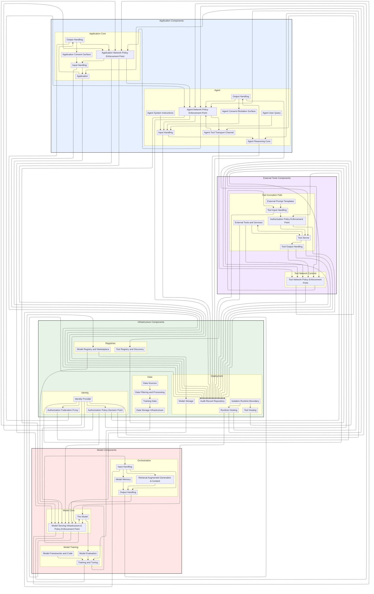

```mermaid
---
config:
  layout: elk
  elk:
    mergeEdges: False
    nodePlacementStrategy: BRANDES_KOEPF
---

graph TD
   %%{init: {'flowchart': {'nodeSpacing': 25, 'rankSpacing': 30, 'padding': 5, 'wrappingWidth': 250}}}%%
    classDef hidden display: none;
    classDef allControl stroke:#4285f4,stroke-width:2px,stroke-dasharray: 5 5

    subgraph componentsInfrastructure ["Infrastructure Components"]
        subgraph componentsData ["Data"]
            componentDataFilteringAndProcessing[Data Filtering and Processing]
            componentDataSources[Data Sources]
            componentDataStorage[Data Storage Infrastructure]
            componentTrainingData[Training Data]
        end
        subgraph componentsDeployment ["Deployment"]
            componentAuditRecordRepository[Audit Record Repository]
            componentIsolationRuntime[Isolation Runtime Boundary]
            componentModelStorage[Model Storage]
            componentRuntimeHosting[Runtime Hosting]
            componentToolHosting[Tool Hosting]
        end
        subgraph componentsRegistries ["Registries"]
            componentModelRegistry[Model Registry and Marketplace]
            componentToolRegistry[Tool Registry and Discovery]
        end
        subgraph componentsIdentity ["Identity"]
            componentAuthorizationPolicyDecisionPoint[Authorization Policy Decision Point]
            componentFederationProxy[Authorization Federation Proxy]
            componentIdentityProvider[Identity Provider]
        end
    end

    subgraph componentsModel ["Model Components"]
        subgraph componentsModelTraining ["Model Training"]
            componentModelEvaluation[Model Evaluation]
            componentModelFrameworksAndCode[Model Frameworks and Code]
            componentModelTrainingTuning[Training and Tuning]
        end
        subgraph componentsModelCore ["Model Core"]
            componentModelServing[Model Serving Infrastructure & Policy Enforcement Point]
            componentTheModel[The Model]
        end
        subgraph componentsOrchestration ["Orchestration"]
            componentMemory[Model Memory]
            componentOrchestrationInputHandling[Input Handling]
            componentOrchestrationOutputHandling[Output Handling]
            componentRAGContent[Retrieval Augmented Generation & Content]
        end
    end

    subgraph componentsApplication ["Application Components"]
        subgraph componentsApplicationCore ["Application Core"]
            componentApplication[Application]
            componentApplicationConsentSurface[Application Consent Surface]
            componentApplicationInputHandling[Input Handling]
            componentApplicationNetworkPolicyEnforcementPoint[Application Network Policy Enforcement Point]
            componentApplicationOutputHandling[Output Handling]
        end
        subgraph componentsAgent ["Agent"]
            componentAgentConsentSurface[Agent Consent Elicitation Surface]
            componentAgentInputHandling[Input Handling]
            componentAgentNetworkPolicyEnforcementPoint[Agent Network Policy Enforcement Point]
            componentAgentOutputHandling[Output Handling]
            componentAgentSystemInstruction[Agent System Instructions]
            componentAgentToolTransport[Agent Tool Transport Channel]
            componentAgentUserQuery[Agent User Query]
            componentReasoningCore[Agent Reasoning Core]
        end
    end

    subgraph componentsExternalTools ["External Tools Components"]
        subgraph componentsToolInvocationPath ["Tool Invocation Path"]
            componentAuthorizationPolicyEnforcementPoint[Authorization Policy Enforcement Point]
            componentExternalPromptTemplate[External Prompt Templates]
            componentToolInputHandling[Tool Input Handling]
            componentToolOutputHandling[Tool Output Handling]
            componentToolServer[Tool Server]
            componentTools[External Tools and Services]
        end
        subgraph componentsToolNetworkControls ["Tool Network Controls"]
            componentToolNetworkPolicyEnforcementPoint[Tool Network Policy Enforcement Point]
        end
    end


    componentDataSources --> componentDataFilteringAndProcessing
    componentDataFilteringAndProcessing --> componentTrainingData
    componentTrainingData --> componentDataStorage
    componentDataStorage --> componentModelTrainingTuning
    componentModelFrameworksAndCode --> componentModelTrainingTuning
    componentModelEvaluation --> componentModelTrainingTuning
    componentModelTrainingTuning --> componentTheModel
    componentModelTrainingTuning --> componentModelRegistry
    componentModelStorage --> componentModelServing
    componentModelServing --> componentTheModel
    componentModelServing --> componentAuditRecordRepository
    componentModelServing --> componentApplicationNetworkPolicyEnforcementPoint
    componentModelServing --> componentAgentNetworkPolicyEnforcementPoint
    componentModelServing --> componentOrchestrationInputHandling
    componentModelRegistry --> componentModelServing
    componentModelRegistry --> componentModelStorage
    componentTheModel --> componentModelEvaluation
    componentTheModel --> componentModelServing
    componentApplication --> componentApplicationOutputHandling
    componentApplication --> componentAuditRecordRepository
    componentApplicationOutputHandling --> componentApplicationNetworkPolicyEnforcementPoint
    componentApplicationOutputHandling --> componentApplicationConsentSurface
    componentApplicationOutputHandling --> componentAuditRecordRepository
    componentApplicationInputHandling --> componentApplication
    componentApplicationInputHandling --> componentAuditRecordRepository
    componentReasoningCore --> componentAgentOutputHandling
    componentReasoningCore --> componentAuditRecordRepository
    componentOrchestrationOutputHandling --> componentAuditRecordRepository
    componentOrchestrationOutputHandling --> componentModelServing
    componentOrchestrationInputHandling --> componentMemory
    componentOrchestrationInputHandling --> componentRAGContent
    componentOrchestrationInputHandling --> componentAuditRecordRepository
    componentOrchestrationInputHandling --> componentOrchestrationOutputHandling
    componentTools --> componentToolServer
    componentTools --> componentToolRegistry
    componentTools --> componentAuditRecordRepository
    componentToolRegistry --> componentToolNetworkPolicyEnforcementPoint
    componentMemory --> componentOrchestrationOutputHandling
    componentRAGContent --> componentOrchestrationOutputHandling
    componentAgentUserQuery --> componentAgentInputHandling
    componentAgentSystemInstruction --> componentAgentInputHandling
    componentAgentInputHandling --> componentReasoningCore
    componentAgentInputHandling --> componentAuditRecordRepository
    componentAgentOutputHandling --> componentAgentConsentSurface
    componentAgentOutputHandling --> componentAgentNetworkPolicyEnforcementPoint
    componentAgentOutputHandling --> componentAuditRecordRepository
    componentIdentityProvider --> componentAuthorizationPolicyDecisionPoint
    componentIdentityProvider --> componentFederationProxy
    componentIdentityProvider --> componentToolNetworkPolicyEnforcementPoint
    componentIdentityProvider --> componentAgentNetworkPolicyEnforcementPoint
    componentIdentityProvider --> componentApplicationNetworkPolicyEnforcementPoint
    componentIdentityProvider --> componentModelServing
    componentAuthorizationPolicyDecisionPoint --> componentAuthorizationPolicyEnforcementPoint
    componentAuthorizationPolicyDecisionPoint --> componentToolNetworkPolicyEnforcementPoint
    componentAuthorizationPolicyDecisionPoint --> componentAgentNetworkPolicyEnforcementPoint
    componentAuthorizationPolicyDecisionPoint --> componentApplicationNetworkPolicyEnforcementPoint
    componentAuthorizationPolicyDecisionPoint --> componentModelServing
    componentExternalPromptTemplate --> componentToolInputHandling
    componentAgentConsentSurface --> componentAgentInputHandling
    componentIsolationRuntime --> componentToolHosting
    componentIsolationRuntime --> componentRuntimeHosting
    componentToolServer --> componentToolOutputHandling
    componentToolServer --> componentTools
    componentToolServer --> componentAuditRecordRepository
    componentAgentToolTransport --> componentAgentNetworkPolicyEnforcementPoint
    componentAgentToolTransport --> componentToolNetworkPolicyEnforcementPoint
    componentFederationProxy --> componentAgentNetworkPolicyEnforcementPoint
    componentFederationProxy --> componentToolNetworkPolicyEnforcementPoint
    componentAgentNetworkPolicyEnforcementPoint --> componentAgentInputHandling
    componentAgentNetworkPolicyEnforcementPoint --> componentAgentToolTransport
    componentAgentNetworkPolicyEnforcementPoint --> componentModelServing
    componentAgentNetworkPolicyEnforcementPoint --> componentApplicationNetworkPolicyEnforcementPoint
    componentAgentNetworkPolicyEnforcementPoint --> componentAuditRecordRepository
    componentAuthorizationPolicyEnforcementPoint --> componentToolServer
    componentAuthorizationPolicyEnforcementPoint --> componentAuditRecordRepository
    componentToolNetworkPolicyEnforcementPoint --> componentAgentToolTransport
    componentToolNetworkPolicyEnforcementPoint --> componentToolInputHandling
    componentToolNetworkPolicyEnforcementPoint --> componentAuditRecordRepository
    componentApplicationConsentSurface --> componentApplicationInputHandling
    componentApplicationNetworkPolicyEnforcementPoint --> componentApplicationInputHandling
    componentApplicationNetworkPolicyEnforcementPoint --> componentModelServing
    componentApplicationNetworkPolicyEnforcementPoint --> componentAgentNetworkPolicyEnforcementPoint
    componentApplicationNetworkPolicyEnforcementPoint --> componentAuditRecordRepository
    componentToolHosting --> componentToolServer
    componentRuntimeHosting --> componentModelServing
    componentRuntimeHosting --> componentApplication
    componentRuntimeHosting --> componentReasoningCore
    componentToolInputHandling --> componentAuthorizationPolicyEnforcementPoint
    componentToolInputHandling --> componentAuditRecordRepository
    componentToolOutputHandling --> componentToolNetworkPolicyEnforcementPoint
    componentToolOutputHandling --> componentAuditRecordRepository

%% Node style definitions
    style componentsInfrastructure fill:#e6f3e6,stroke:#333333,stroke-width:2px
    style componentsApplication fill:#e6f0ff,stroke:#333333,stroke-width:2px
    style componentsModel fill:#ffe6e6,stroke:#333333,stroke-width:2px
    style componentsExternalTools fill:#f3e6ff,stroke:#333333,stroke-width:2px
```
