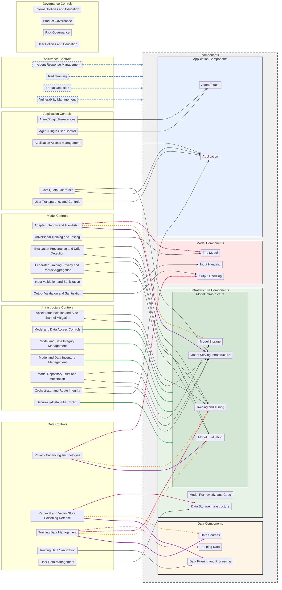

```mermaid
graph LR
   %%{init: {'flowchart': {'nodeSpacing': 25, 'rankSpacing': 150, 'padding': 5, 'wrappingWidth': 250}}}%%
    classDef hidden display: none;
    classDef allControl stroke:#4285f4,stroke-width:2px,stroke-dasharray: 5 5

    subgraph controlsData ["Data Controls"]
        controlPrivacyEnhancingTechnologies[Privacy Enhancing Technologies]
        controlRetrievalAndVectorStorePoisoningDefense[Retrieval and Vector Store Poisoning Defense]
        controlTrainingDataManagement[Training Data Management]
        controlTrainingDataSanitization[Training Data Sanitization]
        controlUserDataManagement[User Data Management]
    end

    subgraph controlsInfrastructure ["Infrastructure Controls"]
        controlAcceleratorIsolationAndSideChannelMitigation[Accelerator Isolation and Side-channel Mitigation]
        controlModelAndDataAccessControls[Model and Data Access Controls]
        controlModelAndDataIntegrityManagement[Model and Data Integrity Management]
        controlModelAndDataInventoryManagement[Model and Data Inventory Management]
        controlModelRepositoryTrustAndAttestation[Model Repository Trust and Attestation]
        controlOrchestratorAndRouteIntegrity[Orchestrator and Route Integrity]
        controlSecureByDefaultMLTooling[Secure-by-Default ML Tooling]
    end

    subgraph controlsModel ["Model Controls"]
        controlAdapterIntegrityAndAllowlisting[Adapter Integrity and Allowlisting]
        controlAdversarialTrainingAndTesting[Adversarial Training and Testing]
        controlEvaluationProvenanceAndDriftDetection[Evaluation Provenance and Drift Detection]
        controlFederatedTrainingPrivacyAndRobustAggregation[Federated Training Privacy and Robust Aggregation]
        controlInputValidationAndSanitization[Input Validation and Sanitization]
        controlOutputValidationAndSanitization[Output Validation and Sanitization]
    end

    subgraph controlsApplication ["Application Controls"]
        controlAgentPluginPermissions[Agent/Plugin Permissions]
        controlAgentPluginUserControl[Agent/Plugin User Control]
        controlApplicationAccessManagement[Application Access Management]
        controlCostQuotaGuardrails[Cost Quota Guardrails]
        controlUserTransparencyAndControls[User Transparency and Controls]
    end

    subgraph controlsAssurance ["Assurance Controls"]
        controlIncidentResponseManagement[Incident Response Management]
        controlRedTeaming[Red Teaming]
        controlThreatDetection[Threat Detection]
        controlVulnerabilityManagement[Vulnerability Management]
    end

    subgraph controlsGovernance ["Governance Controls"]
        direction LR
        controlInternalPoliciesAndEducation[Internal Policies and Education]
        controlProductGovernance[Product Governance]
        controlRiskGovernance[Risk Governance]
        controlUserPoliciesAndEducation[User Policies and Education]
    end

    subgraph components
    subgraph componentsData ["Data Components"]
        componentDataFilteringAndProcessing[Data Filtering and Processing]
        componentDataSources[Data Sources]
        componentTrainingData[Training Data]
    end

    subgraph componentsInfrastructure ["Infrastructure Components"]
        componentDataStorage[Data Storage Infrastructure]
        componentModelFrameworksAndCode[Model Frameworks and Code]
        subgraph componentsModelInfrastructure ["Model Infrastructure"]
            componentModelEvaluation[Model Evaluation]
            componentModelServing[Model Serving Infrastructure]
            componentModelStorage[Model Storage]
            componentModelTrainingTuning[Training and Tuning]
        end
    end

    subgraph componentsModel ["Model Components"]
        componentInputHandling[Input Handling]
        componentOutputHandling[Output Handling]
        componentTheModel[The Model]
    end

    subgraph componentsApplication ["Application Components"]
        componentAgentPlugin[Agent/Plugin]
        componentApplication[Application]
    end

    end

    %% Control to Component relationships
    controlPrivacyEnhancingTechnologies --> componentModelEvaluation
    controlPrivacyEnhancingTechnologies --> componentModelTrainingTuning
    controlPrivacyEnhancingTechnologies --> componentOutputHandling
    controlTrainingDataManagement --> componentDataSources
    controlTrainingDataManagement --> componentModelEvaluation
    controlTrainingDataManagement --> componentModelTrainingTuning
    controlTrainingDataManagement --> componentTrainingData
    controlTrainingDataSanitization --> componentDataFilteringAndProcessing
    controlUserDataManagement --> componentDataStorage
    controlModelAndDataInventoryManagement --> componentsModelInfrastructure
    controlModelAndDataAccessControls --> componentsModelInfrastructure
    controlModelAndDataIntegrityManagement --> componentsModelInfrastructure
    controlSecureByDefaultMLTooling --> componentsModelInfrastructure
    controlInputValidationAndSanitization --> componentInputHandling
    controlOutputValidationAndSanitization --> componentOutputHandling
    controlAdversarialTrainingAndTesting --> componentTheModel
    controlApplicationAccessManagement --> componentApplication
    controlUserTransparencyAndControls --> componentApplication
    controlAgentPluginUserControl --> componentAgentPlugin
    controlAgentPluginPermissions --> componentAgentPlugin
    controlRedTeaming -.-> components
    controlVulnerabilityManagement -.-> components
    controlThreatDetection -.-> components
    controlIncidentResponseManagement -.-> components
    controlAcceleratorIsolationAndSideChannelMitigation --> componentModelServing
    controlAcceleratorIsolationAndSideChannelMitigation --> componentModelTrainingTuning
    controlRetrievalAndVectorStorePoisoningDefense --> componentDataFilteringAndProcessing
    controlRetrievalAndVectorStorePoisoningDefense --> componentDataSources
    controlRetrievalAndVectorStorePoisoningDefense --> componentDataStorage
    controlAdapterIntegrityAndAllowlisting --> componentModelServing
    controlAdapterIntegrityAndAllowlisting --> componentModelStorage
    controlAdapterIntegrityAndAllowlisting --> componentTheModel
    controlFederatedTrainingPrivacyAndRobustAggregation --> componentModelEvaluation
    controlFederatedTrainingPrivacyAndRobustAggregation --> componentModelTrainingTuning
    controlOrchestratorAndRouteIntegrity --> componentApplication
    controlOrchestratorAndRouteIntegrity --> componentModelServing
    controlModelRepositoryTrustAndAttestation --> componentModelServing
    controlModelRepositoryTrustAndAttestation --> componentModelStorage
    controlCostQuotaGuardrails --> componentApplication
    controlCostQuotaGuardrails --> componentModelServing
    controlEvaluationProvenanceAndDriftDetection --> componentModelEvaluation
    controlEvaluationProvenanceAndDriftDetection --> componentModelTrainingTuning

    %% Apply styling to controls mapped to 'all'
    controlIncidentResponseManagement:::allControl
    controlRedTeaming:::allControl
    controlThreatDetection:::allControl
    controlVulnerabilityManagement:::allControl

    %% Edge styling
    linkStyle 20,21,22,23 stroke:#4285f4,stroke-width:3px,stroke-dasharray: 8 4
    linkStyle 9,10,11,12 stroke:#34a853,stroke-width:2px
    linkStyle 0,3,26,29 stroke:#9c27b0,stroke-width:2px
    linkStyle 1,4,27,30 stroke:#ff9800,stroke-width:2px,stroke-dasharray: 5 5
    linkStyle 2,5,28,31 stroke:#e91e63,stroke-width:2px,stroke-dasharray: 10 2
    linkStyle 6 stroke:#C95792,stroke-width:2px,stroke-dasharray: 10 5

%% Node style definitions
    style components fill:#f0f0f0,stroke:#666666,stroke-width:3px,stroke-dasharray: 10 5
    style componentsInfrastructure fill:#e6f3e6,stroke:#333333,stroke-width:2px
    style componentsData fill:#fff5e6,stroke:#333333,stroke-width:2px
    style componentsApplication fill:#e6f0ff,stroke:#333333,stroke-width:2px
    style componentsModel fill:#ffe6e6,stroke:#333333,stroke-width:2px
    style componentsModelInfrastructure fill:#d4e6d4,stroke:#333,stroke-width:1px
```