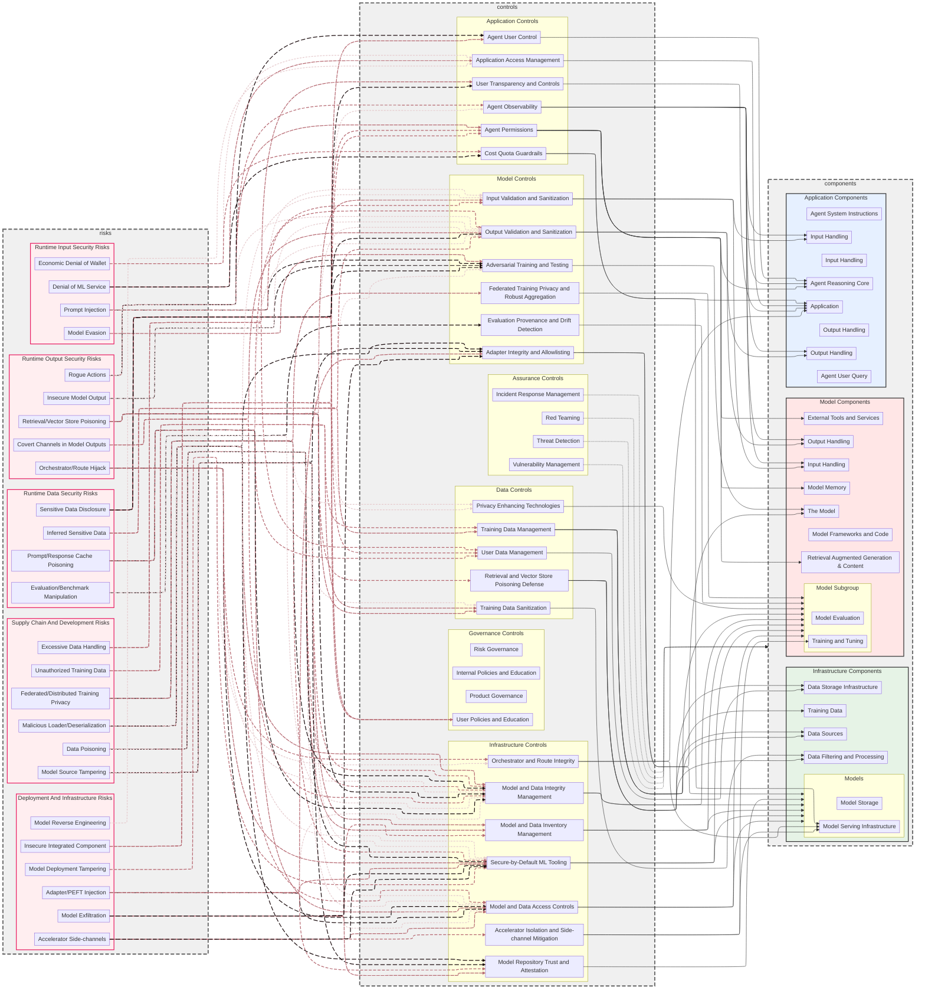

```mermaid
---
config:
  layout: elk
  elk:
    mergeEdges: True
    nodePlacementStrategy: NETWORK_SIMPLEX
---

graph LR
   %%{init: {'flowchart': {'nodeSpacing': 30, 'rankSpacing': 40, 'padding': 5, 'wrappingWidth': 250}}}%%
    classDef hidden display: none;
    classDef allControl stroke:#4285f4,stroke-width:2px,stroke-dasharray: 5 5

    subgraph risks
    subgraph risksSupplyChainAndDevelopment ["Supply Chain And Development Risks"]
        DP[Data Poisoning]
        EDH[Excessive Data Handling]
        FLP[Federated/Distributed Training Privacy]
        MLD[Malicious Loader/Deserialization]
        MST[Model Source Tampering]
        UTD[Unauthorized Training Data]
    end

    subgraph risksDeploymentAndInfrastructure ["Deployment And Infrastructure Risks"]
        ADI[Adapter/PEFT Injection]
        ASC[Accelerator Side-channels]
        IIC[Insecure Integrated Component]
        MDT[Model Deployment Tampering]
        MRE[Model Reverse Engineering]
        MXF[Model Exfiltration]
    end

    subgraph risksRuntimeInputSecurity ["Runtime Input Security Risks"]
        DMS[Denial of ML Service]
        EDW[Economic Denial of Wallet]
        MEV[Model Evasion]
        PIJ[Prompt Injection]
    end

    subgraph risksRuntimeDataSecurity ["Runtime Data Security Risks"]
        EBM[Evaluation/Benchmark Manipulation]
        ISD[Inferred Sensitive Data]
        PCP[Prompt/Response Cache Poisoning]
        SDD[Sensitive Data Disclosure]
    end

    subgraph risksRuntimeOutputSecurity ["Runtime Output Security Risks"]
        COV[Covert Channels in Model Outputs]
        IMO[Insecure Model Output]
        ORH[Orchestrator/Route Hijack]
        RA[Rogue Actions]
        RVP[Retrieval/Vector Store Poisoning]
    end

    end

    subgraph controls
    subgraph controlsData ["Data Controls"]
        controlPrivacyEnhancingTechnologies[Privacy Enhancing Technologies]
        controlRetrievalAndVectorStorePoisoningDefense[Retrieval and Vector Store Poisoning Defense]
        controlTrainingDataManagement[Training Data Management]
        controlTrainingDataSanitization[Training Data Sanitization]
        controlUserDataManagement[User Data Management]
    end

    subgraph controlsInfrastructure ["Infrastructure Controls"]
        controlAcceleratorIsolationAndSideChannelMitigation[Accelerator Isolation and Side-channel Mitigation]
        controlModelAndDataAccessControls[Model and Data Access Controls]
        controlModelAndDataIntegrityManagement[Model and Data Integrity Management]
        controlModelAndDataInventoryManagement[Model and Data Inventory Management]
        controlModelRepositoryTrustAndAttestation[Model Repository Trust and Attestation]
        controlOrchestratorAndRouteIntegrity[Orchestrator and Route Integrity]
        controlSecureByDefaultMLTooling[Secure-by-Default ML Tooling]
    end

    subgraph controlsModel ["Model Controls"]
        controlAdapterIntegrityAndAllowlisting[Adapter Integrity and Allowlisting]
        controlAdversarialTrainingAndTesting[Adversarial Training and Testing]
        controlEvaluationProvenanceAndDriftDetection[Evaluation Provenance and Drift Detection]
        controlFederatedTrainingPrivacyAndRobustAggregation[Federated Training Privacy and Robust Aggregation]
        controlInputValidationAndSanitization[Input Validation and Sanitization]
        controlOutputValidationAndSanitization[Output Validation and Sanitization]
    end

    subgraph controlsApplication ["Application Controls"]
        controlAgentObservability[Agent Observability]
        controlAgentPluginPermissions[Agent Permissions]
        controlAgentPluginUserControl[Agent User Control]
        controlApplicationAccessManagement[Application Access Management]
        controlCostQuotaGuardrails[Cost Quota Guardrails]
        controlUserTransparencyAndControls[User Transparency and Controls]
    end

    subgraph controlsAssurance ["Assurance Controls"]
        controlIncidentResponseManagement[Incident Response Management]
        controlRedTeaming[Red Teaming]
        controlThreatDetection[Threat Detection]
        controlVulnerabilityManagement[Vulnerability Management]
    end

    subgraph controlsGovernance ["Governance Controls"]
        direction LR
        controlInternalPoliciesAndEducation[Internal Policies and Education]
        controlProductGovernance[Product Governance]
        controlRiskGovernance[Risk Governance]
        controlUserPoliciesAndEducation[User Policies and Education]
    end

    end

    subgraph components
    subgraph componentsInfrastructure ["Infrastructure Components"]
        componentDataFilteringAndProcessing[Data Filtering and Processing]
        componentDataSources[Data Sources]
        componentDataStorage[Data Storage Infrastructure]
        componentTrainingData[Training Data]
        subgraph componentsModels ["Models"]
            componentModelServing[Model Serving Infrastructure]
            componentModelStorage[Model Storage]
        end
    end

    subgraph componentsModel ["Model Components"]
        componentMemory[Model Memory]
        componentModelFrameworksAndCode[Model Frameworks and Code]
        componentOrchestrationInputHandling[Input Handling]
        componentOrchestrationOutputHandling[Output Handling]
        componentRAGContent[Retrieval Augmented Generation & Content]
        componentTheModel[The Model]
        componentTools[External Tools and Services]
        subgraph componentsModelSubgroup ["Model Subgroup"]
            componentModelEvaluation[Model Evaluation]
            componentModelTrainingTuning[Training and Tuning]
        end
    end

    subgraph componentsApplication ["Application Components"]
        componentAgentInputHandling[Input Handling]
        componentAgentOutputHandling[Output Handling]
        componentAgentSystemInstruction[Agent System Instructions]
        componentAgentUserQuery[Agent User Query]
        componentApplication[Application]
        componentApplicationInputHandling[Input Handling]
        componentApplicationOutputHandling[Output Handling]
        componentReasoningCore[Agent Reasoning Core]
    end

    end

    %% Risk to Control relationships
    DP --> controlModelAndDataAccessControls
    DP --> controlModelAndDataIntegrityManagement
    DP --> controlModelAndDataInventoryManagement
    DP --> controlSecureByDefaultMLTooling
    DP --> controlTrainingDataSanitization
    UTD --> controlTrainingDataManagement
    UTD --> controlTrainingDataSanitization
    MST --> controlAdapterIntegrityAndAllowlisting
    MST --> controlModelAndDataAccessControls
    MST --> controlModelAndDataIntegrityManagement
    MST --> controlModelAndDataInventoryManagement
    MST --> controlModelRepositoryTrustAndAttestation
    MST --> controlSecureByDefaultMLTooling
    EDH --> controlUserDataManagement
    EDH --> controlUserTransparencyAndControls
    MXF --> controlAdapterIntegrityAndAllowlisting
    MXF --> controlModelAndDataAccessControls
    MXF --> controlModelAndDataInventoryManagement
    MXF --> controlModelRepositoryTrustAndAttestation
    MXF --> controlSecureByDefaultMLTooling
    MDT --> controlOrchestratorAndRouteIntegrity
    MDT --> controlSecureByDefaultMLTooling
    DMS --> controlApplicationAccessManagement
    DMS --> controlCostQuotaGuardrails
    MRE --> controlApplicationAccessManagement
    IIC --> controlAgentPluginPermissions
    IIC --> controlUserPoliciesAndEducation
    PIJ --> controlAdversarialTrainingAndTesting
    PIJ --> controlInputValidationAndSanitization
    PIJ --> controlOutputValidationAndSanitization
    MEV --> controlAdversarialTrainingAndTesting
    SDD --> controlAdversarialTrainingAndTesting
    SDD --> controlAgentObservability
    SDD --> controlAgentPluginPermissions
    SDD --> controlAgentPluginUserControl
    SDD --> controlOutputValidationAndSanitization
    SDD --> controlPrivacyEnhancingTechnologies
    SDD --> controlUserDataManagement
    SDD --> controlUserPoliciesAndEducation
    SDD --> controlUserTransparencyAndControls
    ISD --> controlAdversarialTrainingAndTesting
    ISD --> controlOutputValidationAndSanitization
    ISD --> controlTrainingDataManagement
    IMO --> controlAdversarialTrainingAndTesting
    IMO --> controlOutputValidationAndSanitization
    RA --> controlAgentObservability
    RA --> controlAgentPluginPermissions
    RA --> controlAgentPluginUserControl
    RA --> controlOutputValidationAndSanitization
    ASC --> controlAcceleratorIsolationAndSideChannelMitigation
    ASC --> controlModelAndDataAccessControls
    ASC --> controlSecureByDefaultMLTooling
    EDW --> controlApplicationAccessManagement
    EDW --> controlCostQuotaGuardrails
    FLP --> controlFederatedTrainingPrivacyAndRobustAggregation
    FLP --> controlModelAndDataIntegrityManagement
    FLP --> controlPrivacyEnhancingTechnologies
    FLP --> controlSecureByDefaultMLTooling
    ADI --> controlAdapterIntegrityAndAllowlisting
    ADI --> controlModelAndDataAccessControls
    ADI --> controlModelAndDataIntegrityManagement
    ADI --> controlModelRepositoryTrustAndAttestation
    ADI --> controlSecureByDefaultMLTooling
    ORH --> controlModelAndDataAccessControls
    ORH --> controlModelAndDataIntegrityManagement
    ORH --> controlOrchestratorAndRouteIntegrity
    ORH --> controlSecureByDefaultMLTooling
    EBM --> controlEvaluationProvenanceAndDriftDetection
    EBM --> controlModelAndDataIntegrityManagement
    COV --> controlModelAndDataIntegrityManagement
    COV --> controlOutputValidationAndSanitization
    MLD --> controlAdapterIntegrityAndAllowlisting
    MLD --> controlInputValidationAndSanitization
    MLD --> controlModelAndDataAccessControls
    MLD --> controlModelAndDataIntegrityManagement
    MLD --> controlModelRepositoryTrustAndAttestation
    MLD --> controlSecureByDefaultMLTooling
    PCP --> controlInputValidationAndSanitization
    PCP --> controlModelAndDataAccessControls
    PCP --> controlModelAndDataIntegrityManagement
    PCP --> controlOutputValidationAndSanitization
    PCP --> controlUserDataManagement
    RVP --> controlInputValidationAndSanitization
    RVP --> controlModelAndDataIntegrityManagement
    RVP --> controlOutputValidationAndSanitization
    RVP --> controlRetrievalAndVectorStorePoisoningDefense
    RVP --> controlTrainingDataSanitization

    %% Control to Component relationships (reused from ControlGraph)
    controlPrivacyEnhancingTechnologies --> componentsModelSubgroup
    controlTrainingDataManagement --> componentDataSources
    controlTrainingDataManagement --> componentTrainingData
    controlTrainingDataManagement --> componentsModelSubgroup
    controlTrainingDataSanitization --> componentDataFilteringAndProcessing
    controlUserDataManagement --> componentDataStorage
    controlModelAndDataInventoryManagement --> componentsModelSubgroup
    controlModelAndDataInventoryManagement --> componentsModels
    controlModelAndDataAccessControls --> componentsModelSubgroup
    controlModelAndDataAccessControls --> componentsModels
    controlModelAndDataIntegrityManagement --> componentsModelSubgroup
    controlModelAndDataIntegrityManagement --> componentsModels
    controlSecureByDefaultMLTooling --> componentsModelSubgroup
    controlSecureByDefaultMLTooling --> componentsModels
    controlInputValidationAndSanitization --> componentAgentInputHandling
    controlInputValidationAndSanitization --> componentOrchestrationInputHandling
    controlOutputValidationAndSanitization --> componentAgentOutputHandling
    controlOutputValidationAndSanitization --> componentOrchestrationOutputHandling
    controlAdversarialTrainingAndTesting --> componentTheModel
    controlApplicationAccessManagement --> componentApplication
    controlUserTransparencyAndControls --> componentApplication
    controlAgentPluginUserControl --> componentReasoningCore
    controlAgentPluginPermissions --> componentMemory
    controlAgentPluginPermissions --> componentRAGContent
    controlAgentPluginPermissions --> componentReasoningCore
    controlAgentPluginPermissions --> componentTools
    controlRedTeaming -.-> components
    controlVulnerabilityManagement -.-> components
    controlThreatDetection -.-> components
    controlIncidentResponseManagement -.-> components
    controlAgentObservability --> componentAgentInputHandling
    controlAgentObservability --> componentAgentOutputHandling
    controlAgentObservability --> componentOrchestrationInputHandling
    controlAgentObservability --> componentOrchestrationOutputHandling
    controlAgentObservability --> componentReasoningCore
    controlAcceleratorIsolationAndSideChannelMitigation --> componentModelServing
    controlAcceleratorIsolationAndSideChannelMitigation --> componentModelTrainingTuning
    controlRetrievalAndVectorStorePoisoningDefense --> componentDataFilteringAndProcessing
    controlRetrievalAndVectorStorePoisoningDefense --> componentDataSources
    controlRetrievalAndVectorStorePoisoningDefense --> componentDataStorage
    controlAdapterIntegrityAndAllowlisting --> componentTheModel
    controlAdapterIntegrityAndAllowlisting --> componentsModels
    controlFederatedTrainingPrivacyAndRobustAggregation --> componentsModelSubgroup
    controlOrchestratorAndRouteIntegrity --> componentApplication
    controlOrchestratorAndRouteIntegrity --> componentModelServing
    controlModelRepositoryTrustAndAttestation --> componentsModels
    controlCostQuotaGuardrails --> componentApplication
    controlCostQuotaGuardrails --> componentModelServing
    controlEvaluationProvenanceAndDriftDetection --> componentsModelSubgroup

    %% Edge styling
    linkStyle 0,4,8,12,16,20,24,28,32,36,40,44,48,52,56,60,64,68,72,76,80,84 stroke:#e6cbce,stroke-width:2px,stroke-dasharray: 5 3
    linkStyle 1,5,9,13,17,21,25,29,33,37,41,45,49,53,57,61,65,69,73,77,81,85 stroke:#b66871,stroke-width:2px,stroke-dasharray: 8 4
    linkStyle 2,6,10,14,18,22,26,30,34,38,42,46,50,54,58,62,66,70,74,78,82,86 stroke:#b66871,stroke-width:2px,stroke-dasharray: 10 2
    linkStyle 3,7,11,15,19,23,27,31,35,39,43,47,51,55,59,63,67,71,75,79,83 stroke:#1c0d0f,stroke-width:2px,stroke-dasharray: 12 5

%% Node style definitions
    style risksSupplyChainAndDevelopment fill:#ffeef0,stroke:#e91e63,stroke-width:2px
    style risksDeploymentAndInfrastructure fill:#ffeef0,stroke:#e91e63,stroke-width:2px
    style risksRuntimeInputSecurity fill:#ffeef0,stroke:#e91e63,stroke-width:2px
    style risksRuntimeDataSecurity fill:#ffeef0,stroke:#e91e63,stroke-width:2px
    style risksRuntimeOutputSecurity fill:#ffeef0,stroke:#e91e63,stroke-width:2px
    style components fill:#f0f0f0,stroke:#666666,stroke-width:3px,stroke-dasharray: 10 5
    style controls fill:#f0f0f0,stroke:#666666,stroke-width:3px,stroke-dasharray: 10 5
    style risks fill:#f0f0f0,stroke:#666666,stroke-width:3px,stroke-dasharray: 10 5
    style componentsInfrastructure fill:#e6f3e6,stroke:#333333,stroke-width:2px
    style componentsApplication fill:#e6f0ff,stroke:#333333,stroke-width:2px
    style componentsModel fill:#ffe6e6,stroke:#333333,stroke-width:2px
```
