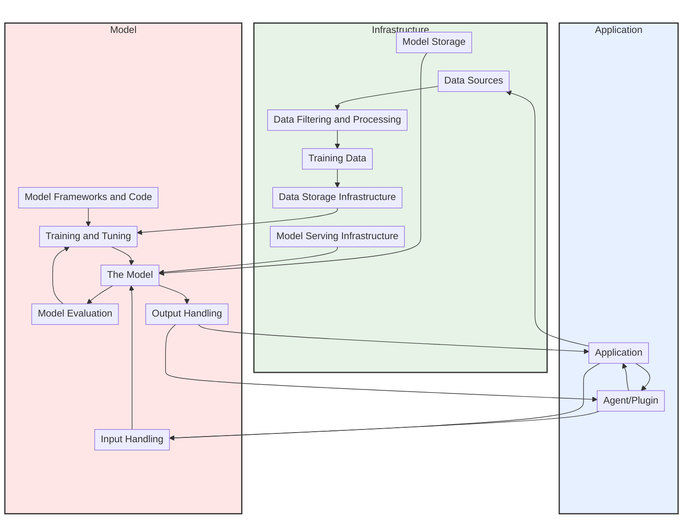

```mermaid
graph TD
   %%{init: {'flowchart': {'nodeSpacing': 25, 'rankSpacing': 30, 'padding': 5, 'wrappingWidth': 250}}}%%
    classDef hidden display: none;
    classDef allControl stroke:#4285f4,stroke-width:2px,stroke-dasharray: 5 5

    root:::hidden
    
subgraph Infrastructure
    InfrastructureAnchor:::hidden ~~~ componentDataSources
    componentDataSources[Data Sources]
    componentDataFilteringAndProcessing[Data Filtering and Processing]
    componentTrainingData[Training Data]
    componentDataStorage[Data Storage Infrastructure]
    componentModelStorage[Model Storage]
    componentModelServing[Model Serving Infrastructure]
    componentModelStorage ~~~~~~~~~~ InfrastructureEnd:::hidden
end
subgraph Model
    ModelAnchor:::hidden ~~~~~~ componentModelFrameworksAndCode
    componentModelFrameworksAndCode[Model Frameworks and Code]
    componentModelEvaluation[Model Evaluation]
    componentModelTrainingTuning[Training and Tuning]
    componentTheModel[The Model]
    componentInputHandling[Input Handling]
    componentOutputHandling[Output Handling]
    componentInputHandling ~~~~~ ModelEnd:::hidden
end
subgraph Application
    ApplicationAnchor:::hidden ~~~~~~~~~~ componentApplication
    componentApplication[Application]
    componentAgentPlugin[Agent/Plugin]
    componentAgentPlugin ~~~~~~ ApplicationEnd:::hidden
end
    root ~~~ InfrastructureAnchor:::hidden
    root ~~~ ModelAnchor:::hidden
    root ~~~ ApplicationAnchor:::hidden

    componentDataSources[Data Sources] --> componentDataFilteringAndProcessing[Data Filtering and Processing]
    componentDataFilteringAndProcessing[Data Filtering and Processing] --> componentTrainingData[Training Data]
    componentTrainingData[Training Data] --> componentDataStorage[Data Storage Infrastructure]
    componentDataStorage[Data Storage Infrastructure] --> componentModelTrainingTuning[Training and Tuning]
    componentModelFrameworksAndCode[Model Frameworks and Code] --> componentModelTrainingTuning[Training and Tuning]
    componentModelEvaluation[Model Evaluation] --> componentModelTrainingTuning[Training and Tuning]
    componentModelTrainingTuning[Training and Tuning] --> componentTheModel[The Model]
    componentModelStorage[Model Storage] --> componentTheModel[The Model]
    componentModelServing[Model Serving Infrastructure] --> componentTheModel[The Model]
    componentTheModel[The Model] --> componentOutputHandling[Output Handling]
    componentTheModel[The Model] --> componentModelEvaluation[Model Evaluation]
    componentInputHandling[Input Handling] --> componentTheModel[The Model]
    componentOutputHandling[Output Handling] --> componentApplication[Application]
    componentOutputHandling[Output Handling] --> componentAgentPlugin[Agent/Plugin]
    componentApplication[Application] --> componentInputHandling[Input Handling]
    componentApplication[Application] --> componentAgentPlugin[Agent/Plugin]
    componentApplication[Application] --> componentDataSources[Data Sources]
    componentAgentPlugin[Agent/Plugin] --> componentInputHandling[Input Handling]
    componentAgentPlugin[Agent/Plugin] --> componentApplication[Application]

%% Style definitions
    style Infrastructure fill:#e6f3e6,stroke:#333333,stroke-width:2px
    style Application fill:#e6f0ff,stroke:#333333,stroke-width:2px
    style Model fill:#ffe6e6,stroke:#333333,stroke-width:2px
```