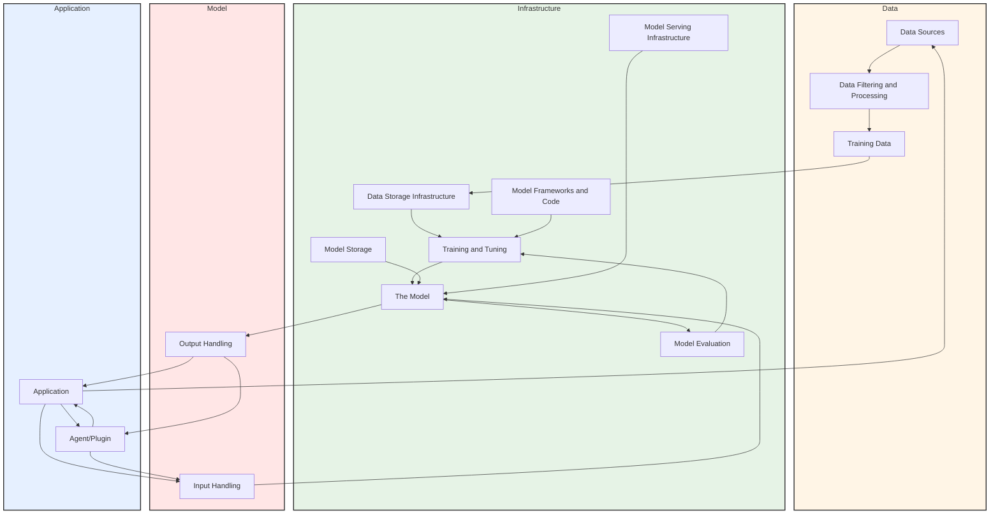

```mermaid
graph TD
    classDef hidden display: none;

    componentDataSources[Data Sources] --> componentDataFilteringAndProcessing[Data Filtering and Processing]
    componentDataFilteringAndProcessing[Data Filtering and Processing] --> componentTrainingData[Training Data]
    componentTrainingData[Training Data] --> componentDataStorage[Data Storage Infrastructure]
    componentDataStorage[Data Storage Infrastructure] --> componentTrainingTuning[Training and Tuning]
    componentModelFrameworksAndCode[Model Frameworks and Code] --> componentTrainingTuning[Training and Tuning]
    componentModelEvaluation[Model Evaluation] --> componentTrainingTuning[Training and Tuning]
    componentTrainingTuning[Training and Tuning] --> componentTheModel[The Model]
    componentModelStorage[Model Storage] --> componentTheModel[The Model]
    componentModelServing[Model Serving Infrastructure] --> componentTheModel[The Model]
    componentTheModel[The Model] --> componentOutputHandling[Output Handling]
    componentTheModel[The Model] --> componentModelEvaluation[Model Evaluation]
    componentInputHandling[Input Handling] --> componentTheModel[The Model]
    componentOutputHandling[Output Handling] --> componentApplication[Application]
    componentOutputHandling[Output Handling] --> componentAgentPlugin[Agent/Plugin]
    componentApplication[Application] --> componentInputHandling[Input Handling]
    componentApplication[Application] --> componentAgentPlugin[Agent/Plugin]
    componentApplication[Application] --> componentDataSources[Data Sources]
    componentAgentPlugin[Agent/Plugin] --> componentInputHandling[Input Handling]
    componentAgentPlugin[Agent/Plugin] --> componentApplication[Application]

subgraph Data
    componentDataSources[Data Sources]
    componentDataFilteringAndProcessing[Data Filtering and Processing]
    componentTrainingData[Training Data]
    componentDataSources ~~~~~~~~~~~ DataEnd:::hidden
end
subgraph Infrastructure
    componentDataStorage[Data Storage Infrastructure]
    componentTrainingTuning[Training and Tuning]
    componentModelFrameworksAndCode[Model Frameworks and Code]
    componentModelEvaluation[Model Evaluation]
    componentModelStorage[Model Storage]
    componentModelServing[Model Serving Infrastructure]
    InfrastructureAnchor:::hidden ~~~~~~~ componentTheModel
    componentModelServing ~~~~~~~~~~~ InfrastructureEnd:::hidden
end
subgraph Model
    componentTheModel[The Model]
    componentOutputHandling[Output Handling]
    componentInputHandling[Input Handling]
    ModelAnchor:::hidden ~~~~~~~ componentTheModel
    componentTheModel ~~~ ModelEnd:::hidden
end
subgraph Application
    componentApplication[Application]
    componentAgentPlugin[Agent/Plugin]
    ApplicationAnchor:::hidden ~~~~~~~ componentTheModel
    componentApplication ~~~~ ApplicationEnd:::hidden
end

%% Style definitions
    style Infrastructure fill:#e6f3e6,stroke:#333,stroke-width:2px
    style Data fill:#fff5e6,stroke:#333,stroke-width:2px
    style Application fill:#e6f0ff,stroke:#333,stroke-width:2px
    style Model fill:#ffe6e6,stroke:#333,stroke-width:2px
```